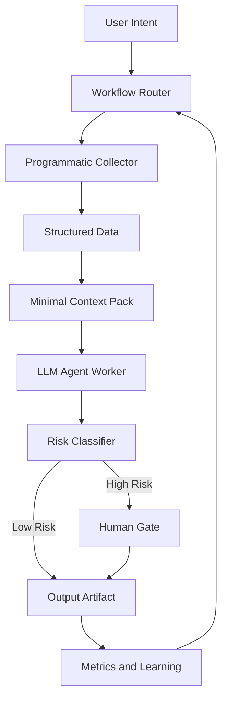

# Investment KOL Ops

Operating system for building an investment KOL account under `CrayonDing0909`.

This repo is for researching platform algorithms, understanding audience pain points,
turning investment analysis into reliable content, building fast AI-agent MVP demos,
and managing the publishing workflow across articles, images, videos, and products.

## Core Pillars

1. Algorithm research: what content formats, hooks, interactions, and distribution
   patterns create account growth.
2. Audience discovery: what non-AI-agent users struggle with, and what MVP demos can
   help them immediately.
3. Investment analysis: repeatable market analysis using the same playbooks used in
   daily research.
4. Content operations: calendar, scripts, visuals, publishing, analytics, and review.
5. Product funnel: convert attention into useful tools, email list, community, and
   eventually paid products.
6. Trust and compliance: clear disclaimers, source discipline, position disclosure,
   and no performance claims without evidence.

## Repo Map

- `docs/ROADMAP.md` - product/business milestone plan.
- `docs/IMPLEMENTATION_PLAN.md` - engineering milestones, per-skill checklist, branch and commit strategy.
- `docs/CONTENT_STRATEGY.md` - positioning, channels, content formats, and cadence.
- `docs/AGENTIC_HARNESS.md` - operating model for AI agents in this repo.
- `docs/WORKFLOW_PATTERNS.md` - canonical workflows for research, analysis, content, MVP.
- `docs/CONTEXT_STRATEGY.md` - context packs and rules for what the LLM sees.
- `docs/HUMAN_GATES.md` - mandatory and optional human approval points.
- `research/ALGORITHM_RESEARCH.md` - platform algorithm research system.
- `research/AUDIENCE_DISCOVERY.md` - audience interviews, pain points, and MVP filters.
- `research/INVESTMENT_ANALYSIS_PLAYBOOK.md` - market analysis workflow and quality gates.
- `content/CONTENT_OPERATING_SYSTEM.md` - publishing workflow and asset pipeline.
- `mvp/MVP_LAB.md` - demo website ideas and validation process.
- `ops/AGENTIC_RUNBOOK.md` - daily routing map: which workflow, pack, and gates per task.
- `ops/METRICS.md` - growth, content, and product metrics.
- `ops/RISK_AND_COMPLIANCE.md` - trust, safety, and compliance checklist.
- `AGENTS.md` - repo-level AI agent instructions.

## Agentic Operating Model

This repo is not just a documentation set. It is an operating system for working
with AI agents. Every meaningful task runs through the harness defined in
[docs/AGENTIC_HARNESS.md](docs/AGENTIC_HARNESS.md).

The harness is built on five principles:

1. Orchestration over reasoning - choose a workflow before choosing a model.
2. Programmatic first, LLM second - structure data before asking the LLM.
3. Context at the right moment - load the smallest pack that fits the task.
4. Human-in-the-loop at the right nodes - gates protect irreversible actions.
5. Adaptive flow, not fixed SOP - workflows are templates, not scripts.



Day-to-day routing of intents to workflows, context packs, and gates lives in
[ops/AGENTIC_RUNBOOK.md](ops/AGENTIC_RUNBOOK.md).

## Default Workflow

For each project or campaign:

1. Pick the canonical workflow from
   [docs/WORKFLOW_PATTERNS.md](docs/WORKFLOW_PATTERNS.md).
2. Load the matching context pack from
   [docs/CONTEXT_STRATEGY.md](docs/CONTEXT_STRATEGY.md).
3. Collect structured data and run programmatic checks first.
4. Let the LLM synthesize and draft.
5. Apply the risk classifier and pass through any gates from
   [docs/HUMAN_GATES.md](docs/HUMAN_GATES.md).
6. Save the artifact and update metrics.

The repeatable loop:

```text
Intent -> Workflow -> Structured Data -> Context Pack -> LLM Draft -> Risk and Gates -> Artifact -> Metrics
```

## Current Status

Initial strategy repo with the agentic harness in place. Engineering execution
follows [docs/IMPLEMENTATION_PLAN.md](docs/IMPLEMENTATION_PLAN.md). No
production app yet.
