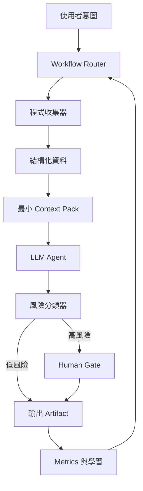

# Investment KOL Ops

> 中文鏡像 / 對照原文：[README.md](README.md)
> 英文為 LLM 主用版本；中文為人類 review 用，不保證每次同步更新。

替 `CrayonDing0909` 建立投資 KOL 帳號的操作系統。

這個 repo 用來研究平台演算法、了解觀眾痛點、把投資分析轉成可信內容、做 AI agent
MVP demo，以及管理發文、文章、圖片、影片、產品的整套發布流程。

它以 artifact-led 操作系統運作：核心單位是一個可發布的 artifact（一張圖、供應鏈
地圖、公司卡、ETF X-ray、AI 工具），研究流程是它底下的品質層。從這裡開始：
[docs/NORTH_STAR.zh.md](docs/NORTH_STAR.zh.md)（方向）、
[docs/ARTIFACT_SYSTEM.zh.md](docs/ARTIFACT_SYSTEM.zh.md)（核心單位）、
[NEXT_ACTIONS.md](NEXT_ACTIONS.md)（今天做什麼）。

## 核心支柱

1. 演算法研究：什麼樣的內容形式、hook、互動、發布模式會帶來帳號成長。
2. 受眾發掘：那些不會用 AI agent 的人卡在哪裡，什麼 demo 可以馬上幫到他們。
3. 投資分析：使用日常的研究 playbook，做可重複、可審查的市場分析。
4. 內容營運：日曆、腳本、視覺素材、發布、分析、複盤。
5. 產品漏斗：把注意力轉成有用的工具、email list、社群、最後付費產品。
6. 信任與合規：清楚的 disclaimer、來源紀律、持倉揭露，不做沒證據的績效宣稱。

## Repo Map

- `docs/NORTH_STAR.md` - 唯一方向錨點（定位、受眾、內容支柱）。
- `docs/ARTIFACT_SYSTEM.md` - artifact 模型：類型、L1-L4 分級、生命週期、DoD。
- `NEXT_ACTIONS.md` - 手動維護的每日/每週焦點（本週 / 今天 / Not Now）。
- `ops/weekly/` - 每週 review 儀式與模板。
- `ops/backlog.md` - 草稿 milestone/issue/project-board spec（在 repo 內，尚未上 GitHub）。
- `docs/ROADMAP.md` - 產品/業務 milestone 計畫。
- `docs/IMPLEMENTATION_PLAN.md` - 工程 milestone、各 skill checklist、branch 與 commit 策略。
- `docs/CONTENT_STRATEGY.md` - 定位、頻道、內容形式、發布節奏。
- `docs/AGENTIC_HARNESS.md` - 本 repo 的 AI agent 操作模型。
- `docs/WORKFLOW_PATTERNS.md` - 研究、分析、內容、MVP 的標準 workflow。
- `docs/CONTEXT_STRATEGY.md` - context pack 與 LLM 該看什麼的規則。
- `docs/HUMAN_GATES.md` - 必須與選擇性的人類確認節點。
- `docs/HTML_READING_UI_GUIDE.md` - 人類閱讀用 HTML 頁面的 UI/UX 規則。
- `docs/AGENT_ROLES.md` - source collection、tutor、knowledge architecture、
  brief building、POV coaching、gate review 的 role 定義。
- `docs/OWNER_HANDOFF_PROTOCOL.md` - 任何需要人類決定的任務，交接時用的 owner 看得懂
  packet 格式（意義優先，git 細節放最後）；模板在 `ops/handoffs/_template.md`。
- `research/ALGORITHM_RESEARCH.md` - 平台演算法研究系統。
- `research/AUDIENCE_DISCOVERY.md` - 觀眾訪談、痛點、MVP 篩選。
- `research/INVESTMENT_ANALYSIS_PLAYBOOK.md` - 市場分析流程與品質 gate。
- `content/CONTENT_OPERATING_SYSTEM.md` - 發布流程與素材 pipeline。
- `mvp/MVP_LAB.md` - demo 網站想法與驗證流程。
- `ops/AGENTIC_RUNBOOK.md` - 日常 routing 表：每個任務該走哪個 workflow / pack / gate。
- `ops/METRICS.md` - 成長、內容、產品 metrics。
- `ops/RISK_AND_COMPLIANCE.md` - 信任、安全、合規 checklist。
- `AGENTS.md` - repo 層級的 AI agent 指令。

## Agentic Operating Model

這個 repo 不只是一份文件集合，而是一套和 AI agent 一起工作的操作系統。所有有意義
的任務都要走 [docs/AGENTIC_HARNESS.zh.md](docs/AGENTIC_HARNESS.zh.md) 定義的 harness。

Harness 建立在 5 個原則上：

1. 流程編排優先於推理 — 先選 workflow，再選模型。
2. 程式優先，LLM 其次 — 把資料整理成 structured data 再交給 LLM。
3. 在對的時機注入 context — 載入最小可完成任務的 context pack。
4. 在對的節點 human-in-the-loop — gate 用來保護不可逆的動作。
5. 動態流程，不是固定 SOP — workflow 是模板不是腳本。



意圖到 workflow / context pack / gate 的日常 routing 在
[ops/AGENTIC_RUNBOOK.zh.md](ops/AGENTIC_RUNBOOK.zh.md)。

## 預設工作流程

每個專案或活動：

1. 從 [docs/WORKFLOW_PATTERNS.zh.md](docs/WORKFLOW_PATTERNS.zh.md) 選一個 canonical
   workflow。
2. 從 [docs/CONTEXT_STRATEGY.zh.md](docs/CONTEXT_STRATEGY.zh.md) 載入對應的 context
   pack。
3. 先收集 structured data，先跑 programmatic checks。
4. 讓 LLM 做 synthesis 和 draft。
5. 套用風險分類器，必要時走
   [docs/HUMAN_GATES.zh.md](docs/HUMAN_GATES.zh.md) 的 gate。
6. 把 artifact 存好，更新 metrics。

可重複的 loop：

```text
意圖 -> Workflow -> Structured Data -> Context Pack -> LLM Draft -> 風險與 Gate -> Artifact -> Metrics
```

## 目前狀態

初期策略 repo，agentic harness 已定義。工程實作依
[docs/IMPLEMENTATION_PLAN.zh.md](docs/IMPLEMENTATION_PLAN.zh.md) 推進。尚未有正式
production app。
