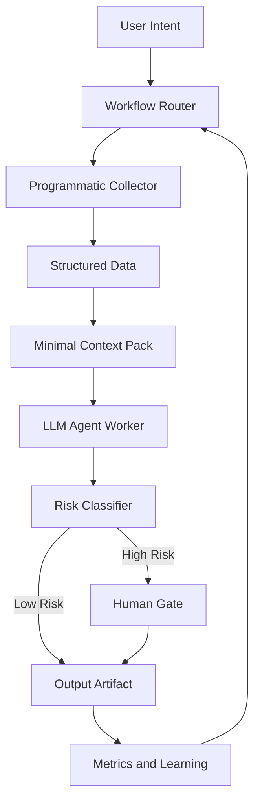

# Agentic Harness

Purpose: define how this repo orchestrates AI agents for the KOL operating system.
The harness is the layer that decides what the agent does, in what order, with what
context, and where humans must approve.

The harness is intentionally documentation-first. It is not an automation runner.
It is the contract that humans and agents follow when working inside this repo.

## Operating Principles

These five principles override prompt-level cleverness. Every workflow in this repo
must respect them.

1. Orchestration over reasoning.
   - The hard problem is task decomposition, ordering, and tool routing.
   - Choose a workflow before choosing a model or a prompt.

2. Programmatic first, LLM second.
   - If a step can be solved with code, scripts, or deterministic rules, do not give
     it to the LLM.
   - Convert raw inputs into structured data first. The LLM should receive curated
     evidence, not raw mess.
   - Cheaper, more stable, and easier to audit.

3. Inject context at the right moment, not all at once.
   - Bigger context windows are not better.
   - Load only the docs, data, and examples relevant to the current step.
   - Use defined `context packs` instead of dumping the whole repo.

4. Human-in-the-loop at the right nodes.
   - Do not interrupt every step. Interrupt where the cost of being wrong is high.
   - The agent does not know when it is wrong. The harness must place gates around
     irreversible or public-facing actions.

5. Adaptive flow, not fixed SOP.
   - Old automation: `if X, do Y`.
   - Agentic flow: choose the next step based on current evidence, risk, and goal.
   - Workflows are templates, not scripts. The agent may skip, branch, or escalate.

## Harness Components

### 1. Workflow Router

Maps user intent to one of the canonical workflows in
[docs/WORKFLOW_PATTERNS.md](WORKFLOW_PATTERNS.md). If no workflow fits, the agent
must ask the human before improvising.

Default routing rules:

- "market analysis" → investment-analysis workflow.
- "what should I post" → content-production workflow.
- "study competitor / platform" → algorithm-research workflow.
- "find a demo idea" → audience-discovery workflow.
- "build/improve a demo" → mvp-demo workflow.

### 2. Programmatic Collector

Gathers raw inputs deterministically: notes, screenshots, posts, metrics, market
data, transcripts, prior artifacts. Only after collection does the LLM see anything.

Examples of programmatic collection:

- Read prior week's drafts and metrics from `content/`.
- Pull a list of published posts and their numeric metrics.
- Aggregate interview notes by tag.
- Validate ticker names, dates, units, and numbers.

Rule: if a field can be parsed, computed, sorted, or validated, do that before
sending it to the LLM.

### 3. Structured Data Layer

The bridge between raw input and the LLM. Always pass the LLM a small, typed,
labeled object instead of long free text.

Minimum fields each workflow's structured data must include:

- Source: where the data came from.
- Timestamp: when it was captured.
- Confidence: known, inferred, or uncertain.
- Tags: workflow, audience segment, content pillar, risk level.

### 4. Context Pack

A pre-defined bundle of docs and templates relevant to the current workflow.
Defined in [docs/CONTEXT_STRATEGY.md](CONTEXT_STRATEGY.md).

Rule: load the smallest context pack that can complete the task. Do not load
unrelated playbooks just because they exist.

### 5. LLM Agent Worker

The LLM is used for what only it can do well:

- Synthesizing structured evidence into a narrative.
- Generating drafts, scripts, scenarios, and explanations.
- Comparing options against a checklist.
- Detecting weak hooks, vague claims, or missing caveats.

The LLM is not used for:

- Counting, sorting, or filtering structured data.
- Storing state.
- Making irreversible publish decisions.
- Pretending to have run a tool or test.

### 6. Risk Classifier

Before any output reaches the world, the harness assigns it a risk level.

| Level | Definition | Default Behavior |
|-------|-----------|------------------|
| Low | Internal notes, drafts, hypotheses. | Auto-approve, log artifact. |
| Medium | Public content with general framing. | Require structured review checklist. |
| High | Investment claims, position-related, demo launch, public correction, paid product. | Require explicit human gate. |

Risk rules are detailed in [docs/HUMAN_GATES.md](HUMAN_GATES.md) and align with
[ops/RISK_AND_COMPLIANCE.md](../ops/RISK_AND_COMPLIANCE.md).

### 7. Human Gate

A defined pause point where the human must accept, edit, or reject before the agent
proceeds. The gate is part of the workflow, not a surprise interrupt.

Each gate must define:

- Trigger condition.
- What artifact is shown to the human.
- Decision options: approve, edit, reject, escalate.
- What happens after each decision.

### 8. Output Artifact

Every workflow ends with a tangible artifact stored in the repo: a brief, draft,
spec, post-publish review, or postmortem. Artifacts are the unit of learning.

### 9. Metrics and Learning Loop

Each artifact is later linked to a result: did the post earn engagement, did the
demo earn feedback, did the analysis hold up. The router uses this signal to bias
future routing decisions, per [ops/METRICS.md](../ops/METRICS.md).

## What Goes Where

| Capability | Owner |
|------------|-------|
| Choose workflow | Router (rules), human override |
| Collect raw data | Programmatic collector |
| Validate units, dates, tickers | Programmatic collector |
| Cluster / classify pains, hooks, themes | LLM, on structured input |
| Draft posts, scripts, scenarios | LLM, with templates |
| Decide if a claim is publish-safe | Human gate (high risk) |
| Decide MVP scope and safety | Human gate |
| Track metrics and learning | Programmatic, then LLM summary |

## Anti-Patterns

- Calling an LLM with the entire repo pasted in.
- Relying on the LLM to remember state across turns.
- Using prompts to enforce rules that should be code or checklists.
- Putting human approval at every step (decision fatigue) or none (unsafe output).
- Treating workflows as fixed scripts instead of adaptive templates.
- Using structured workflows for one-off creative tasks where exploration is the
  point.

## Minimal Loop

If unsure, run this minimum harness loop:

1. Identify intent.
2. Pick a workflow.
3. Collect structured data.
4. Load the smallest relevant context pack.
5. Let the LLM produce a draft artifact.
6. Apply the risk classifier.
7. Pass through the human gate if required.
8. Save the artifact and update metrics.
