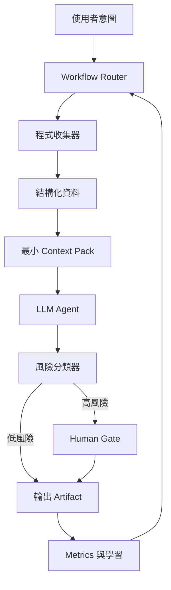

# Agentic Harness（中文版）

> 中文鏡像 / 對照原文：[AGENTIC_HARNESS.md](AGENTIC_HARNESS.md)
> 英文是 LLM 主用版本；中文供人類 review 用。

目的：定義本 repo 如何指揮 AI agent 跑 KOL 操作系統。Harness 決定 agent 做什麼、
照什麼順序、看哪些 context、在哪些節點需要人類批准。

Harness 是文件層級的契約，不是 automation runner。是人類和 agent 在這個 repo 內
都必須遵守的規則。

## 操作原則

這 5 個原則優於任何 prompt 上的小聰明。每個 workflow 都必須遵守。

1. 流程編排優先於推理。
   - 真正困難的是任務分解、排序與工具 routing。
   - 先選 workflow，再選模型或 prompt。

2. 程式優先，LLM 其次。
   - 能用程式、腳本、deterministic 規則處理的，就不要交給 LLM。
   - 先把 raw input 轉成 structured data，LLM 應該收到「整理過的證據」，不是亂糟糟
     的原始資料。
   - 程式更便宜、更穩定、更容易稽核。

3. 在對的時機注入 context，不是一次全塞。
   - context window 大不代表更聰明。
   - 只載入這一步真正需要的文件、資料、範例。
   - 用定義好的 `context pack`，不要把整個 repo 倒進 prompt。

4. Human-in-the-loop 放在對的節點。
   - 不要每一步都打斷。要打斷在「錯了會很貴」的節點。
   - Agent 不會知道自己錯了。Harness 的任務是把 gate 放在不可逆或對外的動作前面。

5. 動態流程，不是固定 SOP。
   - 老式 automation：`if X, do Y`。
   - Agentic flow：根據當下證據、風險、目標，決定下一步。
   - Workflow 是模板不是腳本。Agent 可以跳過、分岔、escalate。

## Harness 元件

### 1. Workflow Router

把使用者意圖映射到 [docs/WORKFLOW_PATTERNS.zh.md](WORKFLOW_PATTERNS.zh.md) 中的 canonical
workflow。如果沒有合適的 workflow，agent 必須先問人，不要硬做。

預設 routing：

- 「市場分析」→ investment-analysis workflow。
- 「該發什麼」→ content-production workflow。
- 「研究競品/平台」→ algorithm-research workflow。
- 「找 demo idea」→ audience-discovery workflow。
- 「做或改 demo」→ mvp-demo workflow。

### 2. 程式收集器

確定性地收集 raw input：筆記、截圖、貼文、metrics、市場資料、訪談記錄、之前的
artifact。LLM 在收集完才看到任何東西。

範例：

- 從 `content/` 讀上週的 draft 和 metrics。
- 拉一份已發布貼文清單和它們的數值 metrics。
- 把訪談筆記依 tag 聚合。
- 驗證 ticker、單位、日期、數字。

規則：欄位能解析、計算、排序、驗證的，都要先做完，才丟給 LLM。

### 3. 結構化資料層

raw input 和 LLM 之間的橋。永遠傳 LLM 一個小、有型別、有 label 的物件，不是大段
free text。

每個 workflow 的 structured data 至少要有：

- Source：資料來源。
- Timestamp：採集時間。
- Confidence：known、inferred、uncertain。
- Tags：workflow、受眾段、內容支柱、風險等級。

### 4. Context Pack

針對當前 workflow 的 docs 和 template 預先打包好。定義在
[docs/CONTEXT_STRATEGY.zh.md](CONTEXT_STRATEGY.zh.md)。

規則：載入「能完成任務的最小 context pack」。不要因為某 playbook 存在就把它載入。

### 5. LLM Agent

LLM 用在只有它做得好的事：

- 把 structured 證據合成成敘事。
- 產生 draft、script、scenario、解說。
- 用 checklist 比較選項。
- 抓出弱 hook、含糊宣稱、缺漏的 caveat。

LLM 不該做：

- 計數、排序、過濾 structured data。
- 儲存狀態。
- 做不可逆的發布決策。
- 假裝跑過 tool 或 test。

### 6. 風險分類器

任何輸出送到外面之前，harness 都要打 risk level。

| 等級 | 定義 | 預設行為 |
|------|------|----------|
| Low | 內部筆記、draft、hypothesis。 | 自動通過，記錄 artifact。 |
| Medium | 一般主題的公開內容。 | 跑 structured review checklist。 |
| High | 投資宣稱、持倉相關、demo launch、公開更正、付費產品。 | 必須走 human gate。 |

詳細規則在 [docs/HUMAN_GATES.zh.md](HUMAN_GATES.zh.md)，並對齊
[ops/RISK_AND_COMPLIANCE.md](../ops/RISK_AND_COMPLIANCE.md)。

### 7. Human Gate

明確定義的暫停點，必須等人類 accept、edit、reject 之後才能往下。Gate 是
workflow 的一部分，不是隨機 interrupt。

每個 gate 必須定義：

- 觸發條件。
- 給人類看的 artifact。
- 決策選項：approve、edit、reject、escalate。
- 各個決策後的後續行為。

### 8. 輸出 Artifact

每個 workflow 都要產出實體 artifact 並存到 repo：brief、draft、spec、發布後複盤、
postmortem。Artifact 是學習的基本單位。

### 9. Metrics 與學習 Loop

每個 artifact 之後都要綁到結果：post 有沒有起來、demo 有沒有 feedback、分析最後
站不站得住。Router 用這個訊號偏向更好的下一輪 routing，詳見
[ops/METRICS.md](../ops/METRICS.md)。

## 誰負責什麼

| 能力 | 由誰負責 |
|------|----------|
| 選 workflow | Router（規則）+ 人類覆寫 |
| 收集 raw 資料 | 程式收集器 |
| 驗證 unit、date、ticker | 程式收集器 |
| 對 pain、hook、theme 做 cluster / 分類 | LLM（吃 structured input） |
| 起草 post、script、scenario | LLM（套模板） |
| 判斷某宣稱是否可發布 | Human gate（高風險） |
| 決定 MVP scope 和安全邊界 | Human gate |
| 記錄 metrics 與學習 | 程式先處理，LLM 摘要 |

## Anti-Patterns

- 把整個 repo 貼進 LLM prompt。
- 期待 LLM 跨 turn 自己記住狀態。
- 用 prompt 強迫執行其實該寫成程式或 checklist 的規則。
- 每一步都人工 approve（決策疲勞）或都不 approve（不安全產出）。
- 把 workflow 當固定腳本，不是動態模板。
- 對「探索性、創意性」的一次性任務硬套 structured workflow。

## 最小 Loop

如果不確定怎麼做，照這個 minimum harness loop 跑：

1. 確認意圖。
2. 選 workflow。
3. 收集 structured data。
4. 載入最小相關 context pack。
5. 讓 LLM 產出 draft artifact。
6. 套風險分類器。
7. 必要時走 human gate。
8. 存好 artifact，更新 metrics。
