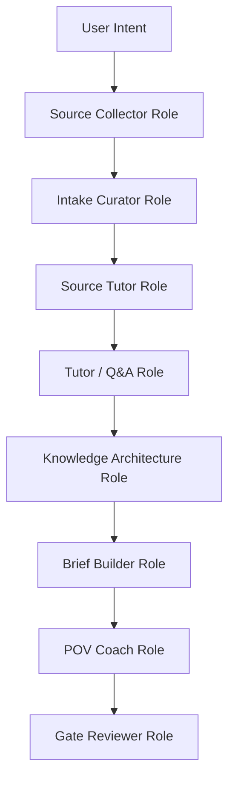

# Agent Roles

This repo uses **roles first**, not custom runtime agents first.

For M1-M2, these roles are instructions inside the harness. They do not need to
be separate Cursor agents or formal skills yet. We should only promote a role
into a real Cursor skill/agent after it has repeated successfully at least 3
times and its inputs/outputs have stabilized.

## Why Roles Before Skills

- Skills are useful when the workflow is stable.
- M1 is still discovering the right process.
- If we create real skills too early, we will freeze the wrong behavior.
- The current priority is learning quality: source collection, tutoring,
  knowledge architecture, and POV formation.

## M1 Roles



## Source Collector Role

Purpose: collect raw source material without drawing conclusions.

What it collects:

- Earnings calls / transcripts / 8-Ks.
- Official IR decks.
- Financial statements and key revenue data.
- Monthly revenue when relevant (especially Taiwan companies).
- News from the last 7-14 days.
- Industry reports or technical explainers.
- Podcasts / newsletters / creator notes.

Canonical output location:

```text
research/sources/<theme>/
  earnings/
  news/
  financials/
  revenue/
  reports/
  podcast-notes/
```

Human-facing reading location:

```text
research/knowledge/<theme>/sources.html
research/knowledge/<theme>/sources/<source-id>.html
```

Rules:

- Do not summarize into a thesis.
- Preserve date, source, company, ticker, and URL.
- Prefer primary sources first: company IR, filings, transcripts.
- Mark secondary sources clearly.
- If a source cannot be verified, label it `unverified`.
- Markdown source packets are canonical; HTML source pages are the default place
  for the user to read them.
- If a collected source may be revisited by the user, add it to the theme's
  `sources.html` shelf and create or update its `sources/<source-id>.html`
  reading page.

Promotion criteria:

- Promote to a real skill only after at least 3 source packets have been created
  with consistent structure.

## Intake Curator Role

Purpose: convert one source into one structured intake note.

Input:

- One source packet or one external material.

Output:

```text
research/intake/YYYY-MM-DD_<source-id>_<topic>.md
```

Responsibilities:

- Extract key claims.
- Extract numbers with units and dates.
- Extract companies, tickers, people, and products.
- Preserve reusable quotes.
- Add theme tags.
- Leave HUMAN-WRITTEN fields empty for the user:
  - My Initial Reaction.
  - Open Questions.

Rules:

- One source -> one intake note.
- Do not merge multiple sources into one intake unless explicitly requested.
- Do not fill the user's reaction or questions.

## Source Tutor Role

Purpose: sit with the user and teach them how to read one already-selected
source precisely. This role improves the user's source reading ability; it does
not find sources.

Input:

- One source packet or source URL.
- Source metadata: publisher, date, source quality, and source class.
- User's reading goal and open questions.
- Claims or numbers the user is considering using.

Output:

```text
research/source-tutor/<theme>/YYYY-MM-DD_<source-id>_reading.md
```

Responsibilities:

- Use the same teaching stance as `domain-doc-tutor`: build the user's mental
  model before summarizing details.
- Explain what problem the source is trying to answer.
- Explain how this class of source should generally be read so the user can
  reuse the lens on other companies and industries, not just this one source.
- Identify which claims the source can support and which claims it cannot.
- Explain what kind of source this is and what it can prove.
- Classify each important claim as:
  - `reported-fact`
  - `management-expectation`
  - `forward-looking-target`
  - `secondary-interpretation`
  - `agent-inference`
  - `open`
- For every important sentence, walk the full reading chain:
  source wording → claim type → what it supports → what it does not prove →
  verification metric → downstream routing.
- Preserve the exact source wording next to the simplified explanation.
- Rewrite risky wording into publish-safe wording.
- Identify the 5 sentences an investor should read most carefully.
- List common misreads, for example treating a management target as current
  market share.
- Turn missing evidence into follow-up source tasks.
- Produce four internalization artifacts that turn the source into reusable
  material:
  - `Claim Ledger` (claim type and safe wording per claim).
  - `Mental Model Update` (2-4 bullets that change how the user thinks).
  - `Verification Watchlist` (next data points or sources to confirm or
    invalidate the strongest claims).
  - `Reusable Output Block` (one paragraph that can drop into a brief or
    article with claim types intact).

Rules:

- The output must teach how to read the source, not only produce safe wording.
  A note that ends at "here is a safer sentence" is incomplete.
- Do not turn the source into a thesis.
- Do not search for replacement or additional sources during the tutoring pass.
  Route missing evidence back to the Source Collector Role.
- Do not upgrade secondary interpretation into primary-source fact.
- Do not collapse "expects," "targets," "guides," "reported," and "estimated"
  into the same confidence level.
- If the user is expected to revisit the explanation, update or create the
  matching HTML source page under `research/knowledge/<theme>/sources/`.
- Keep source-tutor output educational, not investment advice.

Promotion criteria:

- Promote to a real skill only after at least 5 source-tutor notes exist and the
  claim taxonomy has stayed stable.

## Tutor / Q&A Role

Purpose: answer what the user does not understand, in plain Chinese.

Example questions:

- ASIC 是什麼？用在哪裡？為何重要？
- 被動元件是哪些東西？MLCC、鉭電容、鋁電容差在哪？
- HBM 跟一般 DRAM 差在哪？為什麼現在仍重要？
- CPU 在 AI server 裡還有什麼用？不是都 GPU 嗎？
- 液冷、3D VC、cold plate、CDU 差在哪？

Output location:

```text
research/questions/<theme>/<topic>.md
```

Answer format:

```md
# Q&A: <topic>

## Question

<user's question>

## Short Answer

<3-5 sentences in plain Chinese>

## Mental Model

<analogy or simplified model>

## Why Investors Care

<what matters for revenue, margin, valuation, or narrative>

## Companies / Tickers

- <ticker>: <why it matters>

## What To Watch

- <metric / catalyst>

## Sources

- <source path or URL>
```

Rules:

- Tutor answers are educational, not investment advice.
- If the role does not know, say `open` and list the source needed.
- After answering, update the related HTML knowledge page or mark it for update.

Promotion criteria:

- Promote to a skill when the Q&A format is stable and has at least 10 notes.

## Knowledge Architecture Role

Purpose: turn intake notes and Q&A into readable HTML-first knowledge pages.

Output location:

```text
research/knowledge/<theme>/index.html
research/knowledge/<theme>/<topic>.html
```

Responsibilities:

- Maintain the umbrella map.
- Maintain topic pages.
- Separate:
  - known facts
  - market narratives
  - unverified assumptions
  - open questions
- Make pages readable for humans, not only LLMs.
- Keep source links visible.

Rules:

- HTML-first for human reading.
- Static HTML + inline CSS in M1.
- No JS unless a later milestone explicitly needs interactivity.
- Do not hide uncertainty; use `needs follow-up` clearly.

Promotion criteria:

- This role can become a skill after the first full theme has been updated from
  at least three independent source packets.

## Brief Builder Role

Purpose: build the investment-analysis brief from source-backed evidence.

Output location:

```text
research/notes/YYYY-MM-DD_<theme>_<topic>.md
research/notes/YYYY-MM-DD_<theme>_<topic>_sources.md
```

Responsibilities:

- Synthesize evidence into:
  - theme thesis
  - drivers
  - winners / losers
  - key data points
  - scenarios
- Maintain the source checklist.
- Mark confidence as `known`, `inferred`, or `uncertain`.

Rules:

- It may draft AI-FILLED sections.
- It must not write HUMAN-WRITTEN sections.
- If a skill is missing or a source is weak, mark it explicitly.

Promotion criteria:

- Promote to a skill when two full briefs have been built and gate-reviewed.

## POV Coach Role

Purpose: help the user form a real view, not produce one for them.

Input:

- Filled brief.
- Knowledge pages.
- Q&A notes.
- Source checklist.

Output:

- Questions for the user.
- Optional POV prompts inside the brief.
- No final POV text unless the user explicitly dictates it.

Questions it asks:

- What do you now believe that you did not believe before?
- Which part of the thesis feels most fragile?
- What is already priced in?
- What would make you buy, wait, or avoid?
- What would make you change your mind?

Rules:

- Do not write `My POV`.
- Do not write `My Invalidation`.
- Help the user sharpen vague statements.
- Challenge the user if the POV is just a summary.

Promotion criteria:

- This likely remains a rule/role, not a skill, because it depends on the user's
  judgment.

## Gate Reviewer Role

Purpose: enforce human gates and prevent premature publication.

Output:

```text
ops/decisions/YYYY-MM-DD_<gate>_<subject>.md
```

Responsibilities:

- Apply IA1 / IA2 / other gates.
- Check source checklist completeness.
- Check if HUMAN-WRITTEN sections are complete.
- Decide whether gate can be `approve`, `edit`, `reject`, or `defer`.

Rules:

- If human POV is missing, IA1 cannot approve.
- If primary sources are missing for market claims, public content cannot approve.
- `defer` is valid when the structure is good but human work remains.

Promotion criteria:

- Keep as a rule + workflow step for now. It is too high-stakes to fully automate.

## What Needs To Become a Rule Now

Add to agent behavior, no separate skill required yet:

- Do not write articles before the research packet exists.
- Do not write the user's POV.
- Do not approve IA1 while HUMAN-WRITTEN sections are empty.
- Do not treat one podcast summary as sufficient source coverage.
- HTML knowledge pages are the human reading layer; markdown intake/source files
  are the machine-readable layer.

## What Should Wait

Do not create these yet:

- Real Cursor skills for each role.
- Hooks.
- Automation scripts.
- Growth / traffic tracking agent.

Those are M2-M4 work. M1.1 should first prove the research packet loop works.
