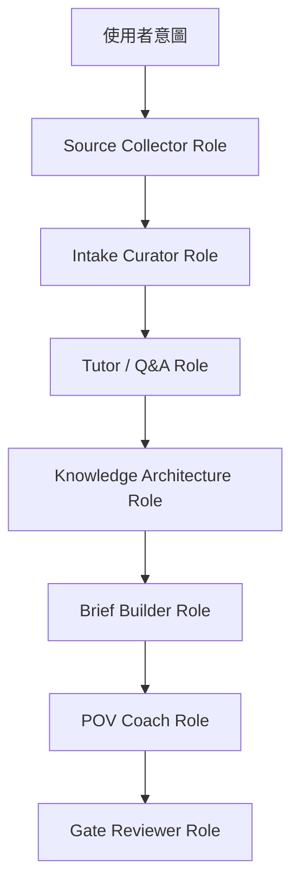

# Agent Roles（中文版）

> 中文鏡像 / 對照原文：[AGENT_ROLES.md](AGENT_ROLES.md)
> 英文是 LLM 主用版本；中文供人類 review 用。

本 repo 目前採用 **先定義 role，不急著做真正 runtime agent / skill**。

M1-M2 階段，這些 roles 是 harness 裡的操作指令，不一定要馬上做成 Cursor agent 或
formal skill。只有當某個 role 重複跑過至少 3 次，而且 input / output 穩定後，才升級
成真正 skill / agent。

## 為什麼先 Role，不先 Skill

- Skill 適合穩定流程。
- M1 還在探索正確流程。
- 太早做成 skill，會把錯的流程凍住。
- 現在最重要的是學習品質：資料蒐集、tutor 問答、知識架構、POV 形成。

## M1 Roles



## Source Collector Role

目的：蒐集 raw source，不下結論。

蒐集內容：

- 法說 / transcript / 8-K。
- 官方 IR deck。
- 財報與關鍵營收資料。
- 月營收（尤其台灣公司）。
- 近 7-14 天新聞。
- 產業報告或技術解釋文。
- Podcast / newsletter / creator notes。

輸出位置：

```text
research/sources/<theme>/
  earnings/
  news/
  financials/
  revenue/
  reports/
  podcast-notes/
```

規則：

- 不要 summary 成 thesis。
- 保留日期、source、公司、ticker、URL。
- 優先 primary source：公司 IR、filing、transcript。
- Secondary source 要明確標記。
- 無法驗證的 source 標 `unverified`。

升級成 skill 的條件：

- 至少產出 3 份 source packet，且結構穩定。

## Intake Curator Role

目的：把一份 source 轉成一份 structured intake note。

輸入：

- 一份 source packet 或一份外部素材。

輸出：

```text
research/intake/YYYY-MM-DD_<source-id>_<topic>.md
```

責任：

- 抽 key claims。
- 抽 numbers（含單位與日期）。
- 抽公司、ticker、人名、產品。
- 保留可重用 quote。
- 加 theme tags。
- 留下 HUMAN-WRITTEN 欄位給使用者：
  - My Initial Reaction。
  - Open Questions。

規則：

- 一份 source → 一份 intake note。
- 不要把多份 source 混成一份 intake，除非明確要求。
- 不要替使用者填 reaction 或 questions。

## Tutor / Q&A Role

目的：用白話中文回答使用者不懂的東西。

範例問題：

- ASIC 是什麼？用在哪裡？為何重要？
- 被動元件是哪些東西？MLCC、鉭電容、鋁電容差在哪？
- HBM 跟一般 DRAM 差在哪？為什麼現在仍重要？
- CPU 在 AI server 裡還有什麼用？不是都 GPU 嗎？
- 液冷、3D VC、cold plate、CDU 差在哪？

輸出位置：

```text
research/questions/<theme>/<topic>.md
```

回答格式：

```md
# Q&A: <topic>

## Question

<user's question>

## Short Answer

<3-5 sentences in plain Chinese>

## Mental Model

<analogy or simplified model>

## Why Investors Care

<what matters for revenue, margin, valuation, or narrative>

## Companies / Tickers

- <ticker>: <why it matters>

## What To Watch

- <metric / catalyst>

## Sources

- <source path or URL>
```

規則：

- Tutor answer 是教育，不是投資建議。
- 不知道就說 `open`，並列出需要哪個 source。
- 回答後要更新相關 HTML knowledge page，或標記待更新。

升級成 skill 的條件：

- Q&A 格式穩定且累積至少 10 份 notes。

## Knowledge Architecture Role

目的：把 intake notes 和 Q&A 整理成 HTML-first knowledge pages。

輸出位置：

```text
research/knowledge/<theme>/index.html
research/knowledge/<theme>/<topic>.html
```

責任：

- 維護 umbrella map。
- 維護 topic pages。
- 分開：
  - 已知事實
  - 市場敘事
  - 未驗證假設
  - open questions
- 讓頁面給人讀，不只是給 LLM 讀。
- 保持 source links 可見。

規則：

- HTML-first 給人類閱讀。
- M1 用 static HTML + inline CSS。
- 除非後續 milestone 明確需要，不加 JS。
- 不隱藏不確定性；明確使用 `needs follow-up`。

升級成 skill 的條件：

- 第一個完整 theme 至少由 3 份 independent source packets 更新過。

## Brief Builder Role

目的：根據 source-backed evidence 建立 investment-analysis brief。

輸出位置：

```text
research/notes/YYYY-MM-DD_<theme>_<topic>.md
research/notes/YYYY-MM-DD_<theme>_<topic>_sources.md
```

責任：

- 綜合 evidence 成：
  - theme thesis
  - drivers
  - winners / losers
  - key data points
  - scenarios
- 維護 source checklist。
- 標記 confidence：`known`、`inferred`、`uncertain`。

規則：

- 可以 draft AI-FILLED sections。
- 不可以寫 HUMAN-WRITTEN sections。
- skill missing 或 source 弱時，必須明確標記。

升級成 skill 的條件：

- 兩份完整 brief 被建立並走過 gate review。

## POV Coach Role

目的：幫使用者形成真正觀點，不替使用者寫觀點。

輸入：

- Filled brief。
- Knowledge pages。
- Q&A notes。
- Source checklist。

輸出：

- 問使用者的問題。
- brief 裡可選的 POV prompts。
- 除非使用者明確口述，不輸出 final POV text。

它會問：

- 你現在相信什麼，是之前不相信的？
- thesis 最脆弱的地方在哪？
- 市場已經 price in 哪些？
- 你會買、等、還是避開？
- 什麼會讓你改變想法？

規則：

- 不寫 `My POV`。
- 不寫 `My Invalidation`。
- 幫使用者把含糊句子 sharpen。
- 如果 POV 只是 summary，要 challenge 使用者。

升級成 skill 的條件：

- 這個很可能保持 role/rule，不做成 skill，因為它仰賴使用者判斷。

## Gate Reviewer Role

目的：執行 human gates，避免過早發布。

輸出：

```text
ops/decisions/YYYY-MM-DD_<gate>_<subject>.md
```

責任：

- 套用 IA1 / IA2 / 其他 gates。
- 檢查 source checklist 完整度。
- 檢查 HUMAN-WRITTEN sections 是否完成。
- 決定 gate 是 `approve`、`edit`、`reject`、還是 `defer`。

規則：

- human POV 缺失時，IA1 不能 approve。
- market claims 缺 primary source 時，公開內容不能 approve。
- 結構正確但還有人類工作未完成時，`defer` 是合法 decision。

升級成 skill 的條件：

- 先維持 rule + workflow step。這個太高風險，不適合完全自動化。

## 現在需要變成 Rule 的事

不需要獨立 skill，但 agent 行為必須遵守：

- Research packet 還不存在前，不寫文章。
- 不替使用者寫 POV。
- HUMAN-WRITTEN sections 空白時，不 approve IA1。
- 不把一份 podcast summary 當成足夠 source coverage。
- HTML knowledge pages 是人類閱讀層；markdown intake/source files 是機器可讀層。

## 先不要做的事

現在不要建立：

- 每個 role 的正式 Cursor skill。
- hooks。
- automation scripts。
- 流量 / growth tracking agent。

那些是 M2-M4。M1.1 應該先證明 research packet loop 能跑。
