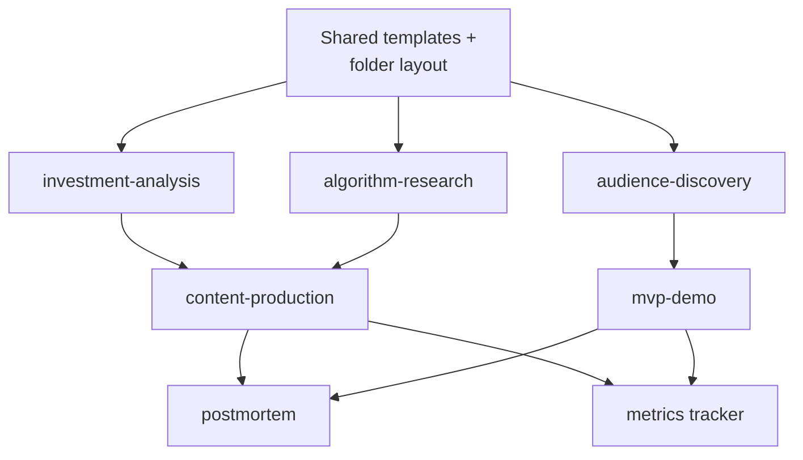

# Implementation Plan

How we move the agentic harness from documentation contract to executable SOP.
Use this file to track progress.

Related:

- [docs/ROADMAP.md](ROADMAP.md): product/business milestones (positioning, content
  sprints, MVP launch, audience growth).
- [docs/AGENT_ROLES.md](AGENT_ROLES.md): operating roles for source collection,
  tutoring, knowledge architecture, brief building, POV coaching, and gate review.
- This file: engineering/operational milestones (templates, scripts, commands,
  infrastructure that make workflows actually run).

## Definition of "Running"

The harness is considered running when:

1. A single intent triggers a known workflow without re-explaining the rules.
2. Each workflow has a repeatable input format and produces a repeatable artifact
   stored in a fixed location.
3. High-risk steps have a real review surface, not just a verbal gate.

## Milestone Map


## Per-Skill Status Grid

Track which milestone each skill currently lives in.

| Skill | M1.0 | M1.1 | M1.2 | M2 | M3 | M4 | M5 |
|-------|------|------|------|----|----|----|----|
| investment-analysis | scaffold-done* | research-packet-done* | pov-done* |  | repurpose | command | metrics |
| algorithm-research |  |  |  | shared | core | command | summary |
| content-production |  |  |  | article-draft-done* | core | command | publish-check |
| audience-discovery |  |  |  | shared |  | command | interviews + clusters |
| mvp-demo |  |  |  | shared |  |  | first spec |
| postmortem |  |  |  | shared |  |  | first run |

## M1 - Theme Knowledge Investment Workflow

Goal: run a source-backed, learning-first investment workflow for the first theme:
`AI Server Supply Chain`.

M1 is **not** a public article milestone. It is the path from raw material to
understanding:

```text
sources -> intake -> knowledge architecture -> tutor Q&A -> brief -> personal POV -> gate
```

M1 is split into three sub-milestones so we do not pretend a scaffold is a
finished research process.

### M1.0 - Scaffold (current PR)

Goal: build the folder structure, templates, HTML-first knowledge skeleton, EP659
intake, and the first brief skeleton.

Tasks:

- [x] Create M1 folders: `research/templates/`, `research/notes/`,
      `research/intake/`, `research/knowledge/ai-server-supply-chain/`,
      `content/drafts/`, `ops/decisions/`.
- [x] Write `research/templates/analysis-brief.md`.
- [x] Write `research/templates/source-checklist.md`.
- [x] Write `docs/analysis-skill-mapping.md`.
- [x] Write HTML-first knowledge templates:
      `research/templates/knowledge-map.html` and
      `research/templates/knowledge-page.html`.
- [x] Ingest 股癌 EP659 into six intake notes: CPU, ASIC, memory,
      passive components, cooling, software.
- [x] Build first HTML-first knowledge map skeleton:
      `research/knowledge/ai-server-supply-chain/index.html` + 6 topic pages.
- [x] Create first CPU anchor brief skeleton and source checklist.
- [x] Run IA1 dry-run gate and log decision as `defer`, because the
      HUMAN-WRITTEN sections are intentionally left for the user.

Definition of Done:

- M1.0 branch / PR clearly labeled as scaffold, not full M1.
- HTML knowledge skeleton is readable in browser.
- Source checklist exists and distinguishes `known`, `inferred`, and `uncertain`.
- IA1 gate decision is logged as `defer`.

### M1.1 - Research Packet

Goal: collect real external sources and turn the scaffold into a source-backed
research packet.

Required roles:

- Source Collector Agent: collect earnings calls, news, financials, revenue, and
  company IR material.
- Tutor / Q&A Agent: answer the user's knowledge gaps in plain Chinese.
- Knowledge Architecture Agent: update HTML pages with sourced explanations.
- Brief Builder Agent: rebuild the brief from collected sources and tutor answers.

Tasks:

- [x] Create `research/sources/ai-server-supply-chain/` with subfolders:
      `earnings/`, `news/`, `financials/`, `revenue`, `reports/`, `podcast-notes/`.
- [x] Collect source packets for at least AMD, Intel, and MediaTek:
      - earnings call / transcript / 8-K or official IR material
      - latest major news items
      - relevant revenue or financial data
- [x] Convert each source into intake notes.
- [x] Create `research/questions/ai-server-supply-chain/` and record Q&A for
      CPU, ASIC, passive components, memory, cooling, and software.
- [x] Update HTML knowledge pages from source-backed Q&A, not just EP659.
- [x] Rewrite the CPU anchor brief from the source-backed research packet.
- [x] Re-run IA1 dry-run with the updated source checklist.

Definition of Done:

- At least 3 company source packets: AMD, Intel, MediaTek.
- At least 6 tutor Q&A notes (one per theme).
- HTML knowledge pages updated with sourced explanations.
- CPU brief no longer relies only on EP659.
- IA1 decision remains `defer` only if human POV is still missing; otherwise it
  can move to `edit` or `approve`.

### M1.2 - POV Completion

Goal: complete the human side of the workflow and convert IA1 from `defer` to a
real decision.

Tasks:

- [x] User fills the HUMAN-WRITTEN sections in the CPU brief:
      - What I Learned
      - What I Still Don't Understand
      - My POV (≥ 200 words)
      - My Invalidation (exactly 3 signals)
- [x] User fills the IA1 reflection questions.
- [x] Agent checks that POV/invalidation are specific and not vague.
- [x] IA1 gate re-runs and updates decision from `defer` to
      `approve`, `edit`, or `reject`.

Definition of Done:

- One filled, source-backed internal brief in `research/notes/`.
- IA1 gate decision is no longer `defer`.
- The user can explain the thesis without reading the brief verbatim.
- No public article yet. Public content starts in M2/M3.

## M2 - Internal Article Draft

Goal: convert the M1 source-backed research baseline into the first readable
internal article draft. This is still **not public publishing**.

Why this comes next:

- M1 proved the learning / source / brief / POV loop.
- M2 tests whether that research can become a readable article without losing
  source discipline.
- Public distribution and metrics tracking start later.

Tasks:

- [x] Create `content/templates/internal-article.md`.
- [x] Draft the first internal article from the CPU revival research baseline:
      `content/drafts/2026-05-12_ai-server-supply-chain_internal-article.md`.
- [x] Create a human-readable HTML version:
      `content/drafts/2026-05-12_ai-server-supply-chain_internal-article.html`.
- [x] Mark the draft `public_status: not-public-ready`.
- [x] Include review checklist and public blockers inside the draft.
- [x] Review the draft for voice: is it useful, specific, and not too AI-like?
- [x] Decide whether to proceed to M2.1 public-readiness hardening or M3 publish
      experiment.

Definition of Done:

- One internal article draft exists in Markdown.
- One HTML reading view exists for the draft.
- The draft clearly says what still blocks public release.
- The draft is understandable without opening the original brief.
- The draft is not yet scheduled or published.

### M2.1 - Public-Readiness Source Hardening

Goal: harden the highest-risk claims in the internal article before any public
repurposing.

Status: done for the current CPU anchor scope.

Completed:

- AMD `server CPU TAM >$120B by 2030` corrected from the earlier AMD revenue
  misread.
- AMD `>50% server CPU revenue market share` framed as a forward-looking target.
- MediaTek `AI ASIC ~$2B Q4 2026` verified against official transcript and
  framed as management expectation.
- BusinessNext CPU latency claim backed by Georgia Tech / Intel primary research
  paper.
- Data-quality checker run with 0 findings.

Remaining before public use:

- HBM source packets.
- Cooling source packets.
- Passive component source packets.
- Scenario-analyzer run.
- Final human edit.

### M2.2 - Source Reading UX + Source Tutor Workflow

Goal: make source-backed research readable and navigable for the user, so source
collection improves the user's primary-source reading ability instead of only
feeding downstream briefs.

Completed:

- Added the `source-tutor` workflow and context pack.
- Added source tutor reading template and claim taxonomy fields:
  `reported-fact`, `management-expectation`, `forward-looking-target`,
  `secondary-interpretation`, `agent-inference`, and `open`.
- Clarified Source Collector output ownership:
  - canonical Markdown packets in `research/sources/<theme>/`.
  - human-facing HTML shelf in `research/knowledge/<theme>/sources.html`.
  - individual source pages in `research/knowledge/<theme>/sources/<source>.html`.
- Added `Original Source Links` and `Next Reading Step` sections to individual
  source HTML pages.
- Added `我現在該看什麼？` guidance to the source shelf.
- Added the missing Georgia Tech / Intel paper HTML source page.

Definition of Done:

- Every collected source that the user may revisit has a visible HTML path.
- Source pages link back to the original website, filing, paper, transcript, or
  PDF.
- The source shelf tells the user what to read next based on intent.
- Source tutor is documented as a reading workflow, not a source discovery
  workflow.

## M3 - Two More Workflows

Goal: algorithm-research and content-production are runnable.

### algorithm-research

- [ ] `research/swipe/_template.md`.
- [ ] `research/swipe/_index.md`.
- [ ] 5 real swipe entries from real platforms.
- [ ] AR1 gate run on at least one adopted tactic.

### content-production

- [ ] `content/templates/thread.md`, `carousel.md`, `short.md`, `blog.md`,
      `launch-post.md`.
- [ ] `content/calendar.md` with 2 weeks ahead.
- [ ] One thread published from the M1 analysis brief.
- [ ] IA1 gate run on the thread (because it carries an investment claim).

Definition of Done:

- 5 swipe entries with hypotheses extracted.
- 1 published thread tied to the M1 analysis.
- 2-week content calendar in place.

## M4 - Triggers and Collectors

Goal: common workflows are triggerable via Cursor commands and small scripts.

Tasks:

- [ ] `scripts/run_weekly_analysis.py`: calls trading skills, builds structured
      input, hands to the LLM step.
- [ ] `scripts/new_swipe.py`: URL → stub swipe entry.
- [ ] `scripts/swipe_summary.py`: cluster + hypothesis output.
- [ ] `scripts/new_draft.py`: source artifact → draft stub.
- [ ] Cursor command `/analysis-week`.
- [ ] Cursor command `/swipe <url>`.
- [ ] Cursor command `/draft <source>`.

Definition of Done:

- One Cursor command runs end-to-end.
- One Python script callable independently.
- Documented usage in IMPLEMENTATION_PLAN updates section.

## M5 - Metrics, Publishing, Assets

Goal: close the learning loop.

### Metrics

- [ ] Populate `ops/metrics.csv` with first month of post metrics.
- [ ] `scripts/weekly_review.py`: aggregate metrics into a markdown summary.

### Publishing

- [ ] `scripts/publish_check.py`: runs the review checklist on a draft.
- [ ] Asset pipeline: charts, screenshots, basic visuals workflow.

### Audience and MVP

- [ ] 3 logged interviews under `research/interviews/`.
- [ ] First pain cluster in `research/pain-clusters/`.
- [ ] First MVP spec under `mvp/specs/` (recommended: Backtest Sanity Checker or
      Market Regime Explainer).

### Postmortem

- [ ] First postmortem on any miss or underperformer.

Definition of Done:

- Metrics tracked weekly for 4 weeks.
- One postmortem published or kept internal.
- One MVP spec ready for MVP1 gate.

## Skill Dependencies

Some skills must wait for others to be runnable:



Cheapest path: shared infra → investment-analysis → content-production → metrics.

## First-Week Concrete Checklist

These are the highest-leverage tasks. All low-risk documentation/scripts.

- [ ] Create stub folders listed in M1.
- [ ] Write `research/templates/analysis-brief.md`.
- [ ] Write `docs/analysis-skill-mapping.md`.
- [ ] Run one weekly market analysis end-to-end manually with a human IA1 review.
- [ ] Write a first-pass `scripts/run_weekly_analysis.py`.
- [ ] Add Cursor command `/analysis-week`.

After this week, you should have:

- One real analysis that went through gate.
- One repeatable template.
- One executable script.
- One triggerable command.

## Branch and Commit Strategy

This repo is solo + personal, so optimize for low overhead and clean history.

### Default Rules

- Commit small content edits and documentation directly to `main`.
- Use short-lived feature branches for: scripts, MVP builds, risky refactors,
  experiments, and any change you might want to revert cleanly.
- Self-review before merging by reading the diff in full.
- Push after each meaningful commit. Treat the remote as your safety net.

### Branch Naming

```text
feat/<area>-<short-description>
docs/<area>-<short-description>
script/<short-description>
mvp/<demo-name>
fix/<area>-<short-description>
chore/<short-description>
```

Examples:

```text
feat/investment-analysis-template
script/run-weekly-analysis
mvp/backtest-sanity-checker
docs/translate-research-files
chore/cursor-commands
```

### Commit Message Convention

Use conventional prefixes:

- `feat:` new content or feature.
- `docs:` documentation only.
- `script:` new or updated script.
- `mvp:` MVP-related work.
- `fix:` bug or copy fix.
- `refactor:` reorganize without behavior change.
- `chore:` maintenance, configs, gitignore.

Example messages:

```text
feat(investment-analysis): add analysis brief template
docs(harness): clarify gate decision logging
script(swipe): scaffold new_swipe.py
mvp(backtest): add MVP spec stub
chore: add ops/decisions folder
```

### When to Branch vs Commit Direct

Direct to `main`:

- Typo or copy fix.
- Adding a new doc that does not change existing flows.
- Updating this plan with checkbox progress.
- Translation updates.

Branch:

- Any new script.
- Any MVP build.
- Any change that touches more than 3 files.
- Any change you might want to revert.
- Cursor command additions.

### Solo PR Practice

Even without a teammate:

1. Push branch.
2. Open a self-PR on GitHub.
3. Read the full diff in the PR view.
4. Squash and merge.

This keeps a clean log of "one branch = one milestone task" and creates revert
points.

## Progress Log

Use this section to record finished milestone work. Append, do not rewrite.

```text
YYYY-MM-DD - <milestone> - <task>
```

```text
2026-05-10 - M1.0 - Phase A: investment-analysis templates and folders scaffolded (incl. HTML-first knowledge architecture templates)
2026-05-10 - M1.0 - Phase B1: 股癌 EP659 ingested into 6 intake notes; AI Server Supply Chain knowledge map (index + 6 topics) built
2026-05-10 - M1.0 - Phase B2: CPU revival anchor brief skeleton structured; live trading skill outputs marked "skill missing" pending direct invocation
2026-05-10 - M1.0 - Phase C: IA1 dry run logged; decision = defer pending human-written POV / invalidation / reflection
2026-05-10 - M1.0 - Phase D: branch feat/m1-investment-analysis-e2e ready for self-PR merge

2026-05-10 - M1.1 - source/Q&A folder scaffold and templates created
2026-05-10 - M1.1 - AMD / Intel / MediaTek source packets collected and converted into intake notes
2026-05-10 - M1.1 - six tutor Q&A notes created for CPU / ASIC / memory / passive / cooling / software
2026-05-10 - M1.1 - HTML knowledge pages updated with source-backed Q&A links
2026-05-10 - M1.1 - CPU revival brief refreshed from source packets; IA1 remains defer pending M1.2 human POV

2026-05-12 - M1.2 - CPU revival POV worksheet accepted and synced to formal brief
2026-05-12 - M1.2 - IA1 decision updated from defer to approve (internal only), public_status remains not-public-ready
2026-05-12 - M2 - internal article template created
2026-05-12 - M2 - first internal article draft created in Markdown and HTML reading view
2026-05-12 - M2 - internal article self-review added; public blockers retained
2026-05-12 - M2 - raw research voice pass completed; content voice rule added
2026-05-12 - M2.1 - AMD / MediaTek / CPU latency source hardening completed; data-quality checker run with 0 findings
2026-05-13 - M2.2 - Source Reading UX and source-tutor workflow documented; source HTML pages linked to original sources and next reading steps
2026-05-13 - M2.2 - Source tutor upgraded with sentence-level reading chain, internalization artifacts, Cursor rule, and AMD canonical example
2026-05-13 - M2.3 - AI server supply chain coverage expanded with 4 new source packets and 3 structural layers (manufacturing capacity, procurement & tightness, geopolitics & policy); Intel Q1 2026 source-tutor reading note added
2026-05-13 - M2.3 - Cross-source synthesis mode added to source-tutor (template + Cursor rule + workflow + role); Intel full-thesis v2 cross-source reading note authored and used as validation case
2026-05-13 - M3 - Repo-native dashboard cockpit shipped (ops/build_dashboard.py + data/*.toml + templates/dashboard.css; auto-generates ops/dashboard.html and ops/current.md from frontmatter)
2026-05-13 - M3 - Card #001 (cooling BOM) outline -> draft; removed unsafe "42% of rack cost" hook after spotting denominator conflict, pre-publish blockers recorded
2026-05-13 - M3 - Vercel library deployed (https://investment-kol-ops.vercel.app/library/ai-server-supply-chain/); ops/build_library.sh + vercel.json + .vercelignore in place; only HTML reading subset uploaded, private trees blocked; Card #001 CTA wired to production URL
2026-05-13 - M2.3 - Reading surface rules clarified to preserve canonical data while keeping HTML as the default rendered view
2026-05-14 - M3 - Card #001 cooling BOM completed learning-first flow (domain primer, source tutor, HTML review, IA1 approved) and marked ready for X/Threads platform adaptation
2026-05-14 - M3 - X/Threads official ranking docs summarized for Card #001; preliminary platform versions, publish hypothesis, and success metrics added before real swipe validation
2026-05-15 - M3 - Threads breakout deep-dive (@10m.engineer.investor 0→24K in 1 month via 9-episode series) authored; series-narrative-architecture rule + phased link-placement policy derived; Card #001 pivoted into 3-episode 散熱系列 (Ep1 ready w/ Tesla electricity hook, Ep2/Ep3 outline); M6 社群 Funnel milestone added; ops dashboard regenerated
```

### Per-Skill Status Grid Footnotes

`investment-analysis: pov-done*` — M1.2 completed on 2026-05-12. The CPU
revival worksheet was accepted as an agent-seeded draft for workflow continuity,
synced into the formal brief, and IA1 moved from `defer` to `approve (internal
only)`. Public status remains `not-public-ready` until primary-source hardening
and real skill invocations are done.

`content-production: article-draft-done*` — M2 internal article draft completed
on 2026-05-12. The draft exists in Markdown and HTML reading view, includes
public blockers, and is not scheduled or published. A raw research voice pass
has been completed. M2.1 hardened AMD / MediaTek / CPU latency claims and ran
data-quality checker with 0 findings; public use still requires HBM / cooling /
passive component source packets, scenario-analyzer, and a final human edit.


`investment-analysis: research-packet-done*` — M1.1 source-backed research packet
shipped on 2026-05-10. It includes source packets for AMD / Intel / MediaTek,
source-derived intake notes, six tutor Q&A notes, source-backed HTML knowledge
page updates, a refreshed CPU brief, and an IA1 re-run note. At the time of
M1.1, IA1 remained `defer`; M1.2 later converted it to internal-only approve.


`investment-analysis: scaffold-done*` — M1.0 scaffold shipped on 2026-05-10.
It included folders, templates, 股癌 EP659 intake notes, HTML-first knowledge
architecture skeleton, and a CPU anchor brief skeleton. Later M1.1/M1.2 work
filled the research packet and internal-only POV gate. Skill calls
(theme-detector, market-news-analyst, technical-analyst, scenario-analyzer,
data-quality-checker) are still tagged `skill missing` and need real invocation
before the brief becomes publish-eligible.
