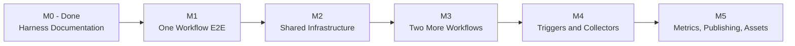
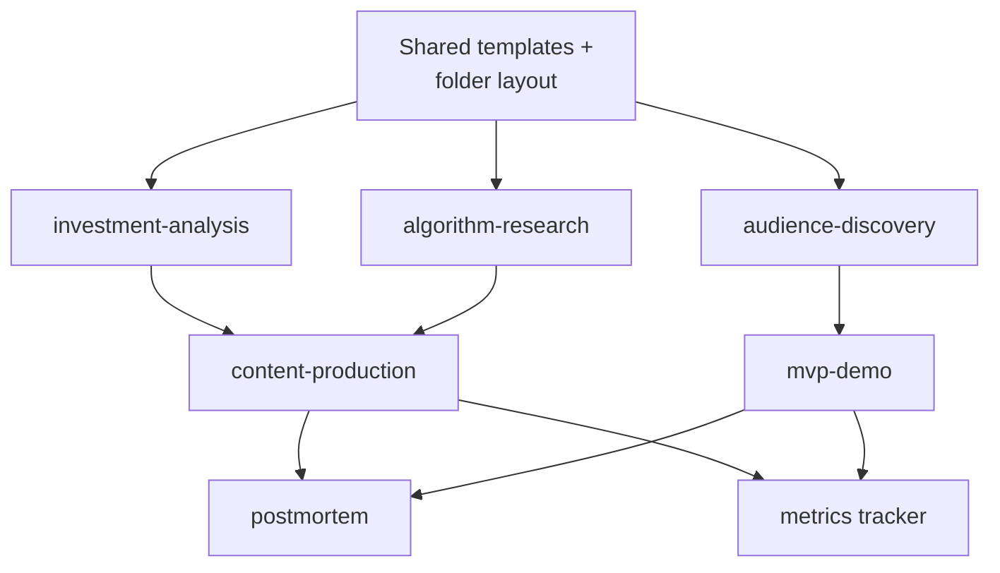

# Implementation Plan

How we move the agentic harness from documentation contract to executable SOP.
Use this file to track progress.

Related:

- [docs/ROADMAP.md](ROADMAP.md): product/business milestones (positioning, content
  sprints, MVP launch, audience growth).
- This file: engineering/operational milestones (templates, scripts, commands,
  infrastructure that make workflows actually run).

## Definition of "Running"

The harness is considered running when:

1. A single intent triggers a known workflow without re-explaining the rules.
2. Each workflow has a repeatable input format and produces a repeatable artifact
   stored in a fixed location.
3. High-risk steps have a real review surface, not just a verbal gate.

## Milestone Map



## Per-Skill Status Grid

Track which milestone each skill currently lives in.

| Skill | M1 | M2 | M3 | M4 | M5 |
|-------|----|----|----|----|----|
| investment-analysis | start | shared | repurpose | command | metrics |
| algorithm-research |  | shared | core | command | summary |
| content-production |  | shared | core | command | publish-check |
| audience-discovery |  | shared |  | command | interviews + clusters |
| mvp-demo |  | shared |  |  | first spec |
| postmortem |  | shared |  |  | first run |

## M1 - One Workflow End-to-End

Goal: produce one real, gate-approved investment analysis brief.

Why first: most leverage from existing trading skills.

Tasks:

- [ ] Create stub folders: `templates/`, `research/swipe/`, `research/interviews/`,
      `research/notes/`, `research/postmortems/`, `mvp/specs/`, `mvp/builds/`,
      `mvp/feedback/`, `ops/decisions/`.
- [ ] Write `research/templates/analysis-brief.md` (matches Investment Analysis
      Workflow output in WORKFLOW_PATTERNS).
- [ ] Write `research/templates/source-checklist.md`.
- [ ] Write `docs/analysis-skill-mapping.md` linking each playbook step to an
      existing trading skill.
- [ ] Run one weekly analysis end-to-end manually, complete IA1 gate, save
      artifact to `content/drafts/`.

Definition of Done:

- One filled analysis brief in `content/drafts/`.
- IA1 gate decision logged in `ops/decisions/`.
- Source checklist filled.
- Invalidation list filled.

## M2 - Shared Infrastructure

Goal: every workflow uses the same folder, naming, and template conventions.

Tasks:

- [ ] Define `templates/_artifact-header.md` with frontmatter:
      `workflow`, `risk`, `created_at`, `source`, `status`.
- [ ] Filename convention: `YYYY-MM-DD_workflow_topic.md`.
- [ ] Create `ops/decisions/` and a decision log template.
- [ ] Create `ops/metrics.csv` with columns aligned to METRICS.md.
- [ ] Add `scripts/lib/` with shared helpers (markdown read/write, LLM call,
      mermaid generation).

Definition of Done:

- One template applied retroactively to all M1 outputs.
- Filename convention used in all new artifacts.
- Empty metrics.csv created.

## M3 - Two More Workflows

Goal: algorithm-research and content-production are runnable.

### algorithm-research

- [ ] `research/swipe/_template.md`.
- [ ] `research/swipe/_index.md`.
- [ ] 5 real swipe entries from real platforms.
- [ ] AR1 gate run on at least one adopted tactic.

### content-production

- [ ] `content/templates/thread.md`, `carousel.md`, `short.md`, `blog.md`,
      `launch-post.md`.
- [ ] `content/calendar.md` with 2 weeks ahead.
- [ ] One thread published from the M1 analysis brief.
- [ ] IA1 gate run on the thread (because it carries an investment claim).

Definition of Done:

- 5 swipe entries with hypotheses extracted.
- 1 published thread tied to the M1 analysis.
- 2-week content calendar in place.

## M4 - Triggers and Collectors

Goal: common workflows are triggerable via Cursor commands and small scripts.

Tasks:

- [ ] `scripts/run_weekly_analysis.py`: calls trading skills, builds structured
      input, hands to the LLM step.
- [ ] `scripts/new_swipe.py`: URL → stub swipe entry.
- [ ] `scripts/swipe_summary.py`: cluster + hypothesis output.
- [ ] `scripts/new_draft.py`: source artifact → draft stub.
- [ ] Cursor command `/analysis-week`.
- [ ] Cursor command `/swipe <url>`.
- [ ] Cursor command `/draft <source>`.

Definition of Done:

- One Cursor command runs end-to-end.
- One Python script callable independently.
- Documented usage in IMPLEMENTATION_PLAN updates section.

## M5 - Metrics, Publishing, Assets

Goal: close the learning loop.

### Metrics

- [ ] Populate `ops/metrics.csv` with first month of post metrics.
- [ ] `scripts/weekly_review.py`: aggregate metrics into a markdown summary.

### Publishing

- [ ] `scripts/publish_check.py`: runs the review checklist on a draft.
- [ ] Asset pipeline: charts, screenshots, basic visuals workflow.

### Audience and MVP

- [ ] 3 logged interviews under `research/interviews/`.
- [ ] First pain cluster in `research/pain-clusters/`.
- [ ] First MVP spec under `mvp/specs/` (recommended: Backtest Sanity Checker or
      Market Regime Explainer).

### Postmortem

- [ ] First postmortem on any miss or underperformer.

Definition of Done:

- Metrics tracked weekly for 4 weeks.
- One postmortem published or kept internal.
- One MVP spec ready for MVP1 gate.

## Skill Dependencies

Some skills must wait for others to be runnable:



Cheapest path: shared infra → investment-analysis → content-production → metrics.

## First-Week Concrete Checklist

These are the highest-leverage tasks. All low-risk documentation/scripts.

- [ ] Create stub folders listed in M1.
- [ ] Write `research/templates/analysis-brief.md`.
- [ ] Write `docs/analysis-skill-mapping.md`.
- [ ] Run one weekly market analysis end-to-end manually with a human IA1 review.
- [ ] Write a first-pass `scripts/run_weekly_analysis.py`.
- [ ] Add Cursor command `/analysis-week`.

After this week, you should have:

- One real analysis that went through gate.
- One repeatable template.
- One executable script.
- One triggerable command.

## Branch and Commit Strategy

This repo is solo + personal, so optimize for low overhead and clean history.

### Default Rules

- Commit small content edits and documentation directly to `main`.
- Use short-lived feature branches for: scripts, MVP builds, risky refactors,
  experiments, and any change you might want to revert cleanly.
- Self-review before merging by reading the diff in full.
- Push after each meaningful commit. Treat the remote as your safety net.

### Branch Naming

```text
feat/<area>-<short-description>
docs/<area>-<short-description>
script/<short-description>
mvp/<demo-name>
fix/<area>-<short-description>
chore/<short-description>
```

Examples:

```text
feat/investment-analysis-template
script/run-weekly-analysis
mvp/backtest-sanity-checker
docs/translate-research-files
chore/cursor-commands
```

### Commit Message Convention

Use conventional prefixes:

- `feat:` new content or feature.
- `docs:` documentation only.
- `script:` new or updated script.
- `mvp:` MVP-related work.
- `fix:` bug or copy fix.
- `refactor:` reorganize without behavior change.
- `chore:` maintenance, configs, gitignore.

Example messages:

```text
feat(investment-analysis): add analysis brief template
docs(harness): clarify gate decision logging
script(swipe): scaffold new_swipe.py
mvp(backtest): add MVP spec stub
chore: add ops/decisions folder
```

### When to Branch vs Commit Direct

Direct to `main`:

- Typo or copy fix.
- Adding a new doc that does not change existing flows.
- Updating this plan with checkbox progress.
- Translation updates.

Branch:

- Any new script.
- Any MVP build.
- Any change that touches more than 3 files.
- Any change you might want to revert.
- Cursor command additions.

### Solo PR Practice

Even without a teammate:

1. Push branch.
2. Open a self-PR on GitHub.
3. Read the full diff in the PR view.
4. Squash and merge.

This keeps a clean log of "one branch = one milestone task" and creates revert
points.

## Progress Log

Use this section to record finished milestone work. Append, do not rewrite.

```text
YYYY-MM-DD - <milestone> - <task>
```

Example:

```text
2026-05-08 - M1 - analysis-brief template scaffolded
2026-05-09 - M1 - first weekly analysis passed IA1 gate
```

(Empty for now. Fill as milestones progress.)
