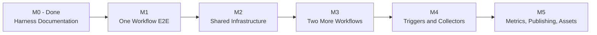
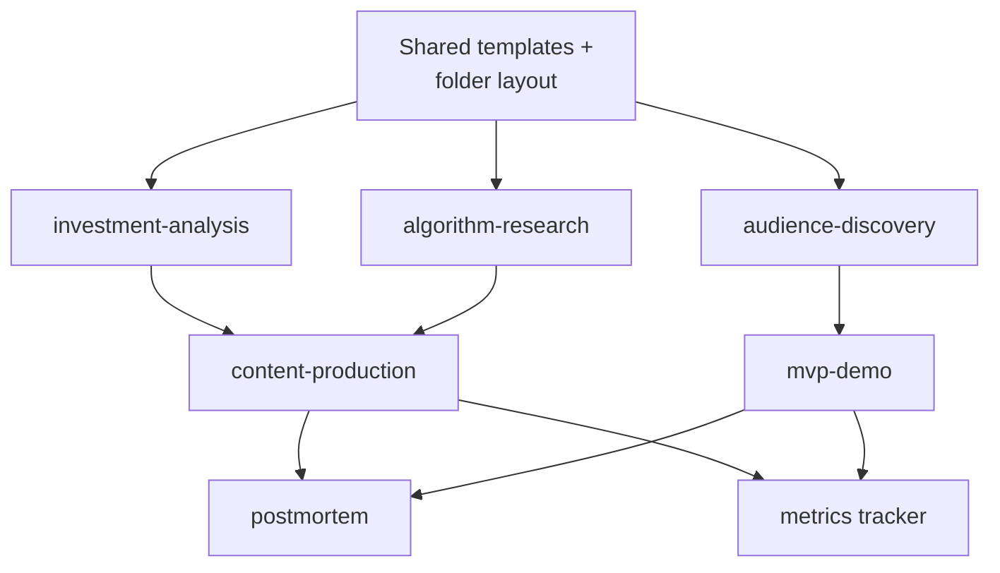

# Implementation Plan

How we move the agentic harness from documentation contract to executable SOP.
Use this file to track progress.

Related:

- [docs/ROADMAP.md](ROADMAP.md): product/business milestones (positioning, content
  sprints, MVP launch, audience growth).
- [docs/AGENT_ROLES.md](AGENT_ROLES.md): operating roles for source collection,
  tutoring, knowledge architecture, brief building, POV coaching, and gate review.
- This file: engineering/operational milestones (templates, scripts, commands,
  infrastructure that make workflows actually run).

## Definition of "Running"

The harness is considered running when:

1. A single intent triggers a known workflow without re-explaining the rules.
2. Each workflow has a repeatable input format and produces a repeatable artifact
   stored in a fixed location.
3. High-risk steps have a real review surface, not just a verbal gate.

## Milestone Map



## Per-Skill Status Grid

Track which milestone each skill currently lives in.

| Skill | M1.0 | M1.1 | M1.2 | M2 | M3 | M4 | M5 |
|-------|------|------|------|----|----|----|----|
| investment-analysis | scaffold-done* | research-packet | pov-completion | shared | repurpose | command | metrics |
| algorithm-research |  |  |  | shared | core | command | summary |
| content-production |  |  |  | shared | core | command | publish-check |
| audience-discovery |  |  |  | shared |  | command | interviews + clusters |
| mvp-demo |  |  |  | shared |  |  | first spec |
| postmortem |  |  |  | shared |  |  | first run |

## M1 - Theme Knowledge Investment Workflow

Goal: run a source-backed, learning-first investment workflow for the first theme:
`AI Server Supply Chain`.

M1 is **not** a public article milestone. It is the path from raw material to
understanding:

```text
sources -> intake -> knowledge architecture -> tutor Q&A -> brief -> personal POV -> gate
```

M1 is split into three sub-milestones so we do not pretend a scaffold is a
finished research process.

### M1.0 - Scaffold (current PR)

Goal: build the folder structure, templates, HTML-first knowledge skeleton, EP659
intake, and the first brief skeleton.

Tasks:

- [x] Create M1 folders: `research/templates/`, `research/notes/`,
      `research/intake/`, `research/knowledge/ai-server-supply-chain/`,
      `content/drafts/`, `ops/decisions/`.
- [x] Write `research/templates/analysis-brief.md`.
- [x] Write `research/templates/source-checklist.md`.
- [x] Write `docs/analysis-skill-mapping.md`.
- [x] Write HTML-first knowledge templates:
      `research/templates/knowledge-map.html` and
      `research/templates/knowledge-page.html`.
- [x] Ingest 股癌 EP659 into six intake notes: CPU, ASIC, memory,
      passive components, cooling, software.
- [x] Build first HTML-first knowledge map skeleton:
      `research/knowledge/ai-server-supply-chain/index.html` + 6 topic pages.
- [x] Create first CPU anchor brief skeleton and source checklist.
- [x] Run IA1 dry-run gate and log decision as `defer`, because the
      HUMAN-WRITTEN sections are intentionally left for the user.

Definition of Done:

- M1.0 branch / PR clearly labeled as scaffold, not full M1.
- HTML knowledge skeleton is readable in browser.
- Source checklist exists and distinguishes `known`, `inferred`, and `uncertain`.
- IA1 gate decision is logged as `defer`.

### M1.1 - Research Packet

Goal: collect real external sources and turn the scaffold into a source-backed
research packet.

Required roles:

- Source Collector Agent: collect earnings calls, news, financials, revenue, and
  company IR material.
- Tutor / Q&A Agent: answer the user's knowledge gaps in plain Chinese.
- Knowledge Architecture Agent: update HTML pages with sourced explanations.
- Brief Builder Agent: rebuild the brief from collected sources and tutor answers.

Tasks:

- [ ] Create `research/sources/ai-server-supply-chain/` with subfolders:
      `earnings/`, `news/`, `financials/`, `revenue`, `reports/`, `podcast-notes/`.
- [ ] Collect source packets for at least AMD, Intel, and MediaTek:
      - earnings call / transcript / 8-K or official IR material
      - latest major news items
      - relevant revenue or financial data
- [ ] Convert each source into intake notes.
- [ ] Create `research/questions/ai-server-supply-chain/` and record Q&A for
      CPU, ASIC, passive components, memory, cooling, and software.
- [ ] Update HTML knowledge pages from source-backed Q&A, not just EP659.
- [ ] Rewrite the CPU anchor brief from the source-backed research packet.
- [ ] Re-run IA1 dry-run with the updated source checklist.

Definition of Done:

- At least 3 company source packets: AMD, Intel, MediaTek.
- At least 6 tutor Q&A notes (one per theme).
- HTML knowledge pages updated with sourced explanations.
- CPU brief no longer relies only on EP659.
- IA1 decision remains `defer` only if human POV is still missing; otherwise it
  can move to `edit` or `approve`.

### M1.2 - POV Completion

Goal: complete the human side of the workflow and convert IA1 from `defer` to a
real decision.

Tasks:

- [ ] User fills the HUMAN-WRITTEN sections in the CPU brief:
      - What I Learned
      - What I Still Don't Understand
      - My POV (≥ 200 words)
      - My Invalidation (exactly 3 signals)
- [ ] User fills the IA1 reflection questions.
- [ ] Agent checks that POV/invalidation are specific and not vague.
- [ ] IA1 gate re-runs and updates decision from `defer` to
      `approve`, `edit`, or `reject`.

Definition of Done:

- One filled, source-backed internal brief in `research/notes/`.
- IA1 gate decision is no longer `defer`.
- The user can explain the thesis without reading the brief verbatim.
- No public article yet. Public content starts in M2/M3.

## M2 - Shared Infrastructure

Goal: every workflow uses the same folder, naming, and template conventions.

Tasks:

- [ ] Define `templates/_artifact-header.md` with frontmatter:
      `workflow`, `risk`, `created_at`, `source`, `status`.
- [ ] Filename convention: `YYYY-MM-DD_workflow_topic.md`.
- [ ] Create `ops/decisions/` and a decision log template.
- [ ] Create `ops/metrics.csv` with columns aligned to METRICS.md.
- [ ] Add `scripts/lib/` with shared helpers (markdown read/write, LLM call,
      mermaid generation).

Definition of Done:

- One template applied retroactively to all M1 outputs.
- Filename convention used in all new artifacts.
- Empty metrics.csv created.

## M3 - Two More Workflows

Goal: algorithm-research and content-production are runnable.

### algorithm-research

- [ ] `research/swipe/_template.md`.
- [ ] `research/swipe/_index.md`.
- [ ] 5 real swipe entries from real platforms.
- [ ] AR1 gate run on at least one adopted tactic.

### content-production

- [ ] `content/templates/thread.md`, `carousel.md`, `short.md`, `blog.md`,
      `launch-post.md`.
- [ ] `content/calendar.md` with 2 weeks ahead.
- [ ] One thread published from the M1 analysis brief.
- [ ] IA1 gate run on the thread (because it carries an investment claim).

Definition of Done:

- 5 swipe entries with hypotheses extracted.
- 1 published thread tied to the M1 analysis.
- 2-week content calendar in place.

## M4 - Triggers and Collectors

Goal: common workflows are triggerable via Cursor commands and small scripts.

Tasks:

- [ ] `scripts/run_weekly_analysis.py`: calls trading skills, builds structured
      input, hands to the LLM step.
- [ ] `scripts/new_swipe.py`: URL → stub swipe entry.
- [ ] `scripts/swipe_summary.py`: cluster + hypothesis output.
- [ ] `scripts/new_draft.py`: source artifact → draft stub.
- [ ] Cursor command `/analysis-week`.
- [ ] Cursor command `/swipe <url>`.
- [ ] Cursor command `/draft <source>`.

Definition of Done:

- One Cursor command runs end-to-end.
- One Python script callable independently.
- Documented usage in IMPLEMENTATION_PLAN updates section.

## M5 - Metrics, Publishing, Assets

Goal: close the learning loop.

### Metrics

- [ ] Populate `ops/metrics.csv` with first month of post metrics.
- [ ] `scripts/weekly_review.py`: aggregate metrics into a markdown summary.

### Publishing

- [ ] `scripts/publish_check.py`: runs the review checklist on a draft.
- [ ] Asset pipeline: charts, screenshots, basic visuals workflow.

### Audience and MVP

- [ ] 3 logged interviews under `research/interviews/`.
- [ ] First pain cluster in `research/pain-clusters/`.
- [ ] First MVP spec under `mvp/specs/` (recommended: Backtest Sanity Checker or
      Market Regime Explainer).

### Postmortem

- [ ] First postmortem on any miss or underperformer.

Definition of Done:

- Metrics tracked weekly for 4 weeks.
- One postmortem published or kept internal.
- One MVP spec ready for MVP1 gate.

## Skill Dependencies

Some skills must wait for others to be runnable:



Cheapest path: shared infra → investment-analysis → content-production → metrics.

## First-Week Concrete Checklist

These are the highest-leverage tasks. All low-risk documentation/scripts.

- [ ] Create stub folders listed in M1.
- [ ] Write `research/templates/analysis-brief.md`.
- [ ] Write `docs/analysis-skill-mapping.md`.
- [ ] Run one weekly market analysis end-to-end manually with a human IA1 review.
- [ ] Write a first-pass `scripts/run_weekly_analysis.py`.
- [ ] Add Cursor command `/analysis-week`.

After this week, you should have:

- One real analysis that went through gate.
- One repeatable template.
- One executable script.
- One triggerable command.

## Branch and Commit Strategy

This repo is solo + personal, so optimize for low overhead and clean history.

### Default Rules

- Commit small content edits and documentation directly to `main`.
- Use short-lived feature branches for: scripts, MVP builds, risky refactors,
  experiments, and any change you might want to revert cleanly.
- Self-review before merging by reading the diff in full.
- Push after each meaningful commit. Treat the remote as your safety net.

### Branch Naming

```text
feat/<area>-<short-description>
docs/<area>-<short-description>
script/<short-description>
mvp/<demo-name>
fix/<area>-<short-description>
chore/<short-description>
```

Examples:

```text
feat/investment-analysis-template
script/run-weekly-analysis
mvp/backtest-sanity-checker
docs/translate-research-files
chore/cursor-commands
```

### Commit Message Convention

Use conventional prefixes:

- `feat:` new content or feature.
- `docs:` documentation only.
- `script:` new or updated script.
- `mvp:` MVP-related work.
- `fix:` bug or copy fix.
- `refactor:` reorganize without behavior change.
- `chore:` maintenance, configs, gitignore.

Example messages:

```text
feat(investment-analysis): add analysis brief template
docs(harness): clarify gate decision logging
script(swipe): scaffold new_swipe.py
mvp(backtest): add MVP spec stub
chore: add ops/decisions folder
```

### When to Branch vs Commit Direct

Direct to `main`:

- Typo or copy fix.
- Adding a new doc that does not change existing flows.
- Updating this plan with checkbox progress.
- Translation updates.

Branch:

- Any new script.
- Any MVP build.
- Any change that touches more than 3 files.
- Any change you might want to revert.
- Cursor command additions.

### Solo PR Practice

Even without a teammate:

1. Push branch.
2. Open a self-PR on GitHub.
3. Read the full diff in the PR view.
4. Squash and merge.

This keeps a clean log of "one branch = one milestone task" and creates revert
points.

## Progress Log

Use this section to record finished milestone work. Append, do not rewrite.

```text
YYYY-MM-DD - <milestone> - <task>
```

```text
2026-05-10 - M1.0 - Phase A: investment-analysis templates and folders scaffolded (incl. HTML-first knowledge architecture templates)
2026-05-10 - M1.0 - Phase B1: 股癌 EP659 ingested into 6 intake notes; AI Server Supply Chain knowledge map (index + 6 topics) built
2026-05-10 - M1.0 - Phase B2: CPU revival anchor brief skeleton structured; live trading skill outputs marked "skill missing" pending direct invocation
2026-05-10 - M1.0 - Phase C: IA1 dry run logged; decision = defer pending human-written POV / invalidation / reflection
2026-05-10 - M1.0 - Phase D: branch feat/m1-investment-analysis-e2e ready for self-PR merge
```

### Per-Skill Status Grid Footnotes

`investment-analysis: scaffold-done*` — M1.0 scaffold shipped on 2026-05-10.
It includes folders, templates, 股癌 EP659 intake notes, HTML-first knowledge
architecture skeleton, and a CPU anchor brief skeleton. The brief at
[research/notes/2026-05-10_ai-server-supply-chain_cpu-revival.md](../research/notes/2026-05-10_ai-server-supply-chain_cpu-revival.md)
still has 4 HUMAN-WRITTEN sections (What I Learned / What I Don't Understand /
My POV / My Invalidation) and 3 reflection questions to be filled by
CrayonDing0909 in M1.2 before IA1 can convert from `defer` to `approve`.
M1.1 must first collect real source packets (AMD / Intel / MediaTek),
run tutor Q&A, and update the knowledge pages. Skill calls (theme-detector,
market-news-analyst, technical-analyst, scenario-analyzer, data-quality-checker)
are tagged `skill missing` and need real invocation before the brief becomes
publish-eligible.
