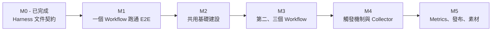
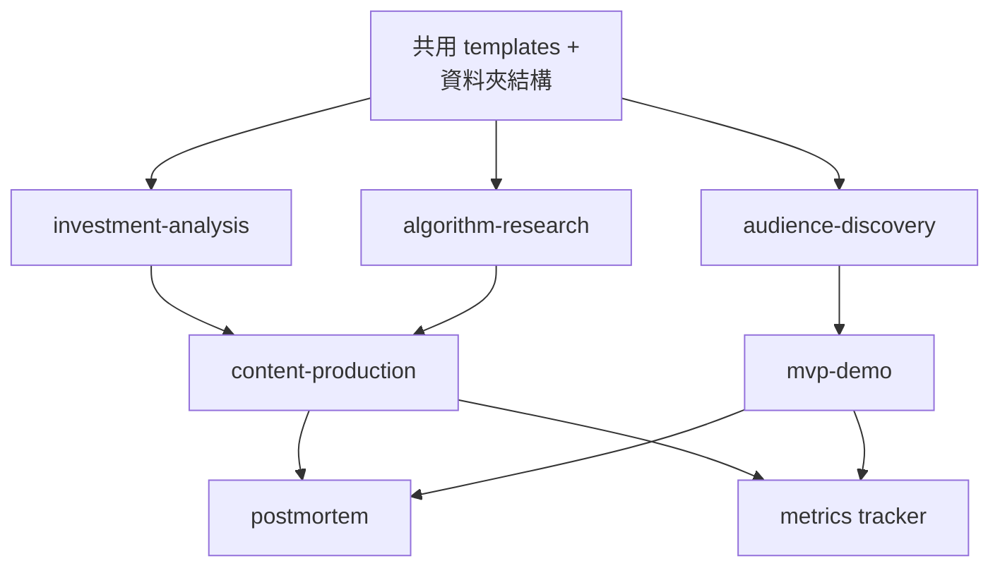

# Implementation Plan（中文版）

> 中文鏡像 / 對照原文：[IMPLEMENTATION_PLAN.md](IMPLEMENTATION_PLAN.md)
> 英文是 LLM 主用版本；中文供人類 review 用。

把 agentic harness 從文件契約推到可執行 SOP 的計畫。本檔案用來追進度。

相關文件：

- [docs/ROADMAP.zh.md](ROADMAP.zh.md)：產品/業務 milestone（定位、內容衝刺、MVP
  上線、受眾成長）。
- 本檔：工程/操作 milestone（templates、scripts、commands、能讓 workflow 真的動
  起來的基礎建設）。

## 「能運作」的定義

Harness 達到下面三件事，才算真的在跑：

1. 一句意圖能觸發已知 workflow，不用每次重講規則。
2. 每個 workflow 有可重複的輸入格式，並產生固定位置的可重複 artifact。
3. 高風險步驟有真正的 review 介面，不是嘴巴 gate。

## Milestone 路線圖



## 各 Skill 進度表

追蹤每個 skill 目前在哪個 milestone。

| Skill | M1 | M2 | M3 | M4 | M5 |
|-------|----|----|----|----|----|
| investment-analysis | start | shared | repurpose | command | metrics |
| algorithm-research |  | shared | core | command | summary |
| content-production |  | shared | core | command | publish-check |
| audience-discovery |  | shared |  | command | interviews + clusters |
| mvp-demo |  | shared |  |  | first spec |
| postmortem |  | shared |  |  | first run |

## M1 - 一個 Workflow 跑通 E2E

目標：用 investment-analysis workflow 真的產出一份過 IA1 gate 的分析 brief。

為什麼先做：對既有 trading skill 有最高槓桿。

任務：

- [ ] 建立 stub 資料夾：`templates/`、`research/swipe/`、`research/interviews/`、
      `research/notes/`、`research/postmortems/`、`mvp/specs/`、`mvp/builds/`、
      `mvp/feedback/`、`ops/decisions/`。
- [ ] 寫 `research/templates/analysis-brief.md`（對應 WORKFLOW_PATTERNS 中
      Investment Analysis Workflow 的 output）。
- [ ] 寫 `research/templates/source-checklist.md`。
- [ ] 寫 `docs/analysis-skill-mapping.md`，把 playbook 各步對應到既有 trading
      skill。
- [ ] 手動跑一次完整的每週分析、走過 IA1 gate，把 artifact 存進 `content/drafts/`。

Definition of Done：

- 一份填好的分析 brief 存在 `content/drafts/`。
- IA1 gate 決策記錄在 `ops/decisions/`。
- Source checklist 填好。
- Invalidation list 填好。

## M2 - 共用基礎建設

目標：每個 workflow 都使用同一套資料夾、命名、template 慣例。

任務：

- [ ] 定義 `templates/_artifact-header.md` frontmatter：
      `workflow`、`risk`、`created_at`、`source`、`status`。
- [ ] 命名規則：`YYYY-MM-DD_workflow_topic.md`。
- [ ] 建立 `ops/decisions/` 與 decision log 模板。
- [ ] 建立 `ops/metrics.csv`，欄位對齊 METRICS。
- [ ] 加 `scripts/lib/`，放共用 helper（讀寫 markdown、LLM 呼叫、mermaid 生成）。

Definition of Done：

- 所有 M1 產出回頭套用同一份 template。
- 所有新 artifact 都用統一命名規則。
- 空的 metrics.csv 已建立。

## M3 - 第二、三個 Workflow

目標：algorithm-research 和 content-production 都可執行。

### algorithm-research

- [ ] `research/swipe/_template.md`。
- [ ] `research/swipe/_index.md`。
- [ ] 5 個來自真實平台的 swipe 條目。
- [ ] 至少對一個採用戰術跑 AR1 gate。

### content-production

- [ ] `content/templates/thread.md`、`carousel.md`、`short.md`、`blog.md`、
      `launch-post.md`。
- [ ] `content/calendar.md`，2 週內排程。
- [ ] 從 M1 分析 brief 產出 1 篇 thread 並發布。
- [ ] 該 thread 走 IA1 gate（含投資宣稱）。

Definition of Done：

- 5 個 swipe 條目並萃取 hypothesis。
- 1 篇從 M1 分析衍生的已發布 thread。
- 2 週內容日曆已就位。

## M4 - 觸發機制與 Collector

目標：常用 workflow 可由 Cursor command 與小型 script 觸發。

任務：

- [ ] `scripts/run_weekly_analysis.py`：呼叫 trading skills，組成 structured
      input，交給 LLM step。
- [ ] `scripts/new_swipe.py`：URL → swipe stub 條目。
- [ ] `scripts/swipe_summary.py`：cluster + hypothesis 輸出。
- [ ] `scripts/new_draft.py`：source artifact → draft stub。
- [ ] Cursor command `/analysis-week`。
- [ ] Cursor command `/swipe <url>`。
- [ ] Cursor command `/draft <source>`。

Definition of Done：

- 至少一個 Cursor command 跑得通 E2E。
- 至少一個 Python script 可獨立呼叫。
- 在 IMPLEMENTATION_PLAN 的 Progress Log 留下使用紀錄。

## M5 - Metrics、發布、素材

目標：把學習 loop 收尾。

### Metrics

- [ ] 把第一個月的 post metrics 填入 `ops/metrics.csv`。
- [ ] `scripts/weekly_review.py`：把 metrics 彙整成 markdown 摘要。

### 發布

- [ ] `scripts/publish_check.py`：對 draft 跑 review checklist。
- [ ] 素材 pipeline：圖表、截圖、基本視覺製作流程。

### 受眾與 MVP

- [ ] 3 場訪談紀錄存進 `research/interviews/`。
- [ ] 第一個 pain cluster 存進 `research/pain-clusters/`。
- [ ] 第一份 MVP spec 存進 `mvp/specs/`（建議：Backtest Sanity Checker 或
      Market Regime Explainer）。

### Postmortem

- [ ] 對任何失準或表現不佳的 artifact 跑第一次 postmortem。

Definition of Done：

- Metrics 連續 4 週每週追蹤。
- 一份 postmortem 完成（公開或內部都可）。
- 第一份 MVP spec 進入 MVP1 gate。

## Skill 依賴

某些 skill 必須等其他 skill 才能跑：



最低成本路徑：共用基礎建設 → investment-analysis → content-production → metrics。

## 第一週具體執行清單

這些都是高槓桿、低風險的 documentation/script：

- [ ] 建立 M1 列出的 stub 資料夾。
- [ ] 寫 `research/templates/analysis-brief.md`。
- [ ] 寫 `docs/analysis-skill-mapping.md`。
- [ ] 手動跑一次每週市場分析 E2E，含 IA1 gate 人工 review。
- [ ] 寫第一版 `scripts/run_weekly_analysis.py`（粗，能跑就好）。
- [ ] 加上 Cursor command `/analysis-week`。

完成這六步後你會擁有：

- 一份過 gate 的真實分析。
- 一份可重複的 template。
- 一隻可執行 script。
- 一個可觸發 command。

## Branch 與 Commit 策略

本 repo 是 solo + personal，要把 overhead 壓低、commit 歷史保持乾淨。

### 預設規則

- 小範圍 content / 文件改動直接 commit 到 `main`。
- 下列情況走短期 feature branch：scripts、MVP builds、有風險的 refactor、實驗、
  或任何你可能想 clean revert 的改動。
- Merge 前自己 review diff 全文。
- 每個有意義的 commit 都 push，把 remote 當保險。

### Branch 命名

```text
feat/<area>-<short-description>
docs/<area>-<short-description>
script/<short-description>
mvp/<demo-name>
fix/<area>-<short-description>
chore/<short-description>
```

範例：

```text
feat/investment-analysis-template
script/run-weekly-analysis
mvp/backtest-sanity-checker
docs/translate-research-files
chore/cursor-commands
```

### Commit Message 慣例

用 conventional prefix：

- `feat:` 新內容或新功能。
- `docs:` 純文件。
- `script:` 新增或修改 script。
- `mvp:` MVP 相關。
- `fix:` bug 或文字修正。
- `refactor:` 重構但不改行為。
- `chore:` 維護、設定、gitignore。

範例：

```text
feat(investment-analysis): add analysis brief template
docs(harness): clarify gate decision logging
script(swipe): scaffold new_swipe.py
mvp(backtest): add MVP spec stub
chore: add ops/decisions folder
```

### 直接 commit vs 開 branch

直接 commit 到 `main`：

- typo 或文字修正。
- 新增不影響既有 flow 的文件。
- 更新本檔的 checkbox 進度。
- 翻譯更新。

開 branch：

- 任何新 script。
- 任何 MVP build。
- 改動超過 3 個檔的變動。
- 你可能會想 revert 的改動。
- 新增 Cursor command。

### Solo PR 慣例

即使單人開發，也建議：

1. Push branch。
2. 在 GitHub 開一個 self-PR。
3. 在 PR 介面把 diff 完整看一遍。
4. Squash merge。

這會保持「一個 branch = 一個 milestone task」的清楚 log，也提供 revert 點。

## Progress Log

每完成一個 milestone task 就 append 一筆，不要改舊紀錄。

```text
YYYY-MM-DD - <milestone> - <task>
```

範例：

```text
2026-05-08 - M1 - analysis-brief template scaffolded
2026-05-09 - M1 - first weekly analysis passed IA1 gate
```

（目前空白，隨進度補上。）
