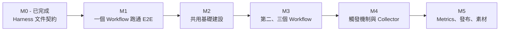
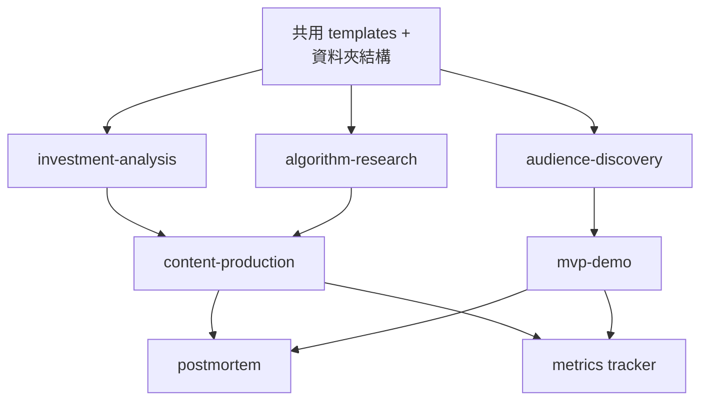

# Implementation Plan（中文版）

> 中文鏡像 / 對照原文：[IMPLEMENTATION_PLAN.md](IMPLEMENTATION_PLAN.md)
> 英文是 LLM 主用版本；中文供人類 review 用。

把 agentic harness 從文件契約推到可執行 SOP 的計畫。本檔案用來追進度。

相關文件：

- [docs/ROADMAP.zh.md](ROADMAP.zh.md)：產品/業務 milestone（定位、內容衝刺、MVP
  上線、受眾成長）。
- 本檔：工程/操作 milestone（templates、scripts、commands、能讓 workflow 真的動
  起來的基礎建設）。

## 「能運作」的定義

Harness 達到下面三件事，才算真的在跑：

1. 一句意圖能觸發已知 workflow，不用每次重講規則。
2. 每個 workflow 有可重複的輸入格式，並產生固定位置的可重複 artifact。
3. 高風險步驟有真正的 review 介面，不是嘴巴 gate。

## Milestone 路線圖



## 各 Skill 進度表

追蹤每個 skill 目前在哪個 milestone。

| Skill | M1.0 | M1.1 | M1.2 | M2 | M3 | M4 | M5 |
|-------|------|------|------|----|----|----|----|
| investment-analysis | scaffold-done* | research-packet-done* | pov-done* |  | repurpose | command | metrics |
| algorithm-research |  |  |  | shared | core | command | summary |
| content-production |  |  |  | article-draft-done* | core | command | publish-check |
| audience-discovery |  |  |  | shared |  | command | interviews + clusters |
| mvp-demo |  |  |  | shared |  |  | first spec |
| postmortem |  |  |  | shared |  |  | first run |

## M1 - Theme Knowledge Investment Workflow

目標：用第一個主題 `AI Server Supply Chain` 跑出一套 source-backed、learning-first
的投資研究流程。

M1 **不是**公開文章 milestone，而是從原料到理解的流程：

```text
sources -> intake -> knowledge architecture -> tutor Q&A -> brief -> personal POV -> gate
```

M1 拆成三個子 milestone，避免把 scaffold 誤認為完整研究流程。

### M1.0 - Scaffold（目前 PR）

目標：建立資料夾、templates、HTML-first knowledge skeleton、EP659 intake、第一份
brief skeleton。

任務：

- [x] 建立 M1 資料夾：`research/templates/`、`research/notes/`、
      `research/intake/`、`research/knowledge/ai-server-supply-chain/`、
      `content/drafts/`、`ops/decisions/`。
- [x] 寫 `research/templates/analysis-brief.md`。
- [x] 寫 `research/templates/source-checklist.md`。
- [x] 寫 `docs/analysis-skill-mapping.md`。
- [x] 寫 HTML-first knowledge templates：
      `research/templates/knowledge-map.html` 與
      `research/templates/knowledge-page.html`。
- [x] 把股癌 EP659 拆成六份 intake notes：CPU、ASIC、memory、被動元件、散熱、軟體。
- [x] 建立第一版 HTML-first knowledge map skeleton：
      `research/knowledge/ai-server-supply-chain/index.html` + 6 topic pages。
- [x] 建立第一份 CPU anchor brief skeleton 與 source checklist。
- [x] 跑 IA1 dry-run gate，decision 記為 `defer`，因為 HUMAN-WRITTEN 區塊刻意留給使用者。

Definition of Done：

- M1.0 branch / PR 明確標成 scaffold，不是完整 M1。
- HTML knowledge skeleton 可直接用 browser 閱讀。
- Source checklist 有區分 `known`、`inferred`、`uncertain`。
- IA1 gate decision 記錄為 `defer`。

### M1.1 - Research Packet

目標：真正蒐集外部 source，把 scaffold 升級成 source-backed research packet。

需要的 roles：

- Source Collector Agent：蒐集法說、新聞、財報、營收、公司 IR。
- Tutor / Q&A Agent：用白話中文回答你的知識缺口。
- Knowledge Architecture Agent：用有來源的解釋更新 HTML pages。
- Brief Builder Agent：根據 sources + tutor answers 重建 brief。

任務：

- [x] 建立 `research/sources/ai-server-supply-chain/`，含 subfolders：
      `earnings/`、`news/`、`financials/`、`revenue/`、`reports/`、`podcast-notes/`。
- [x] 至少蒐集 AMD、Intel、MediaTek 三間公司的 source packets：
      - 法說 / transcript / 8-K 或官方 IR
      - 最新重要新聞
      - 相關營收或財務資料
- [x] 將每份 source 轉成 intake notes。
- [x] 建立 `research/questions/ai-server-supply-chain/`，記錄 CPU、ASIC、被動元件、memory、cooling、software 的 Q&A。
- [x] 用 source-backed Q&A 更新 HTML knowledge pages，不只依賴 EP659。
- [x] 用 source-backed research packet 重寫 CPU anchor brief。
- [x] 用更新後的 source checklist 重跑 IA1 dry-run。

Definition of Done：

- 至少 3 份 company source packets：AMD、Intel、MediaTek。
- 至少 6 份 tutor Q&A notes（一個 theme 一份）。
- HTML knowledge pages 用有來源的解釋更新。
- CPU brief 不再只依賴 EP659。
- 若人類 POV 尚未補完，IA1 可維持 `defer`；否則應轉為 `edit` 或 `approve`。

### M1.2 - POV Completion

目標：完成 human side 的 workflow，把 IA1 從 `defer` 轉成真正 decision。

任務：

- [x] 使用者補完 CPU brief 的 HUMAN-WRITTEN 區塊：
      - What I Learned
      - What I Still Don't Understand
      - My POV (≥ 200 words)
      - My Invalidation (exactly 3 signals)
- [x] 使用者補完 IA1 reflection questions。
- [x] Agent 檢查 POV / invalidation 是否具體，不是空話。
- [x] 重跑 IA1 gate，把 decision 從 `defer` 改成 `approve`、`edit`、或 `reject`。

Definition of Done：

- 一份 filled、source-backed internal brief 在 `research/notes/`。
- IA1 gate decision 不再是 `defer`。
- 使用者能不照念 brief 解釋 thesis。
- 仍不發 public article。公開內容從 M2/M3 開始。

## M2 - Internal Article Draft

目標：把 M1 source-backed research baseline 轉成第一篇可閱讀的 internal article
draft。這仍然**不是公開發布**。

為什麼接著做這個：

- M1 已經跑通 learning / source / brief / POV loop。
- M2 要測試這份研究能不能變成可讀文章，同時不犧牲 source discipline。
- 公開發布與 metrics tracking 之後再開始。

任務：

- [x] 建立 `content/templates/internal-article.md`。
- [x] 從 CPU revival research baseline 產生第一篇 internal article：
      `content/drafts/2026-05-12_ai-server-supply-chain_internal-article.md`。
- [x] 建立 HTML reading view：
      `content/drafts/2026-05-12_ai-server-supply-chain_internal-article.html`。
- [x] 標記 draft `public_status: not-public-ready`。
- [x] 在 draft 內放 review checklist 與 public blockers。
- [x] Review 文章語氣：是否實用、具體、不太 AI 口吻？
- [x] 決定下一步走 M2.1 public-readiness hardening 還是 M3 publish experiment。

Definition of Done：

- 一份 internal article draft 存在 Markdown。
- 一份 HTML reading view 存在。
- Draft 清楚列出公開前還缺什麼。
- 不開原始 brief 也能讀懂 draft。
- Draft 尚未排程或發布。

## M3 - 第二、三個 Workflow

目標：algorithm-research 和 content-production 都可執行。

### algorithm-research

- [ ] `research/swipe/_template.md`。
- [ ] `research/swipe/_index.md`。
- [ ] 5 個來自真實平台的 swipe 條目。
- [ ] 至少對一個採用戰術跑 AR1 gate。

### content-production

- [ ] `content/templates/thread.md`、`carousel.md`、`short.md`、`blog.md`、
      `launch-post.md`。
- [ ] `content/calendar.md`，2 週內排程。
- [ ] 從 M1 分析 brief 產出 1 篇 thread 並發布。
- [ ] 該 thread 走 IA1 gate（含投資宣稱）。

Definition of Done：

- 5 個 swipe 條目並萃取 hypothesis。
- 1 篇從 M1 分析衍生的已發布 thread。
- 2 週內容日曆已就位。

## M4 - 觸發機制與 Collector

目標：常用 workflow 可由 Cursor command 與小型 script 觸發。

任務：

- [ ] `scripts/run_weekly_analysis.py`：呼叫 trading skills，組成 structured
      input，交給 LLM step。
- [ ] `scripts/new_swipe.py`：URL → swipe stub 條目。
- [ ] `scripts/swipe_summary.py`：cluster + hypothesis 輸出。
- [ ] `scripts/new_draft.py`：source artifact → draft stub。
- [ ] Cursor command `/analysis-week`。
- [ ] Cursor command `/swipe <url>`。
- [ ] Cursor command `/draft <source>`。

Definition of Done：

- 至少一個 Cursor command 跑得通 E2E。
- 至少一個 Python script 可獨立呼叫。
- 在 IMPLEMENTATION_PLAN 的 Progress Log 留下使用紀錄。

## M5 - Metrics、發布、素材

目標：把學習 loop 收尾。

### Metrics

- [ ] 把第一個月的 post metrics 填入 `ops/metrics.csv`。
- [ ] `scripts/weekly_review.py`：把 metrics 彙整成 markdown 摘要。

### 發布

- [ ] `scripts/publish_check.py`：對 draft 跑 review checklist。
- [ ] 素材 pipeline：圖表、截圖、基本視覺製作流程。

### 受眾與 MVP

- [ ] 3 場訪談紀錄存進 `research/interviews/`。
- [ ] 第一個 pain cluster 存進 `research/pain-clusters/`。
- [ ] 第一份 MVP spec 存進 `mvp/specs/`（建議：Backtest Sanity Checker 或
      Market Regime Explainer）。

### Postmortem

- [ ] 對任何失準或表現不佳的 artifact 跑第一次 postmortem。

Definition of Done：

- Metrics 連續 4 週每週追蹤。
- 一份 postmortem 完成（公開或內部都可）。
- 第一份 MVP spec 進入 MVP1 gate。

## Skill 依賴

某些 skill 必須等其他 skill 才能跑：



最低成本路徑：共用基礎建設 → investment-analysis → content-production → metrics。

## 第一週具體執行清單

這些都是高槓桿、低風險的 documentation/script：

- [ ] 建立 M1 列出的 stub 資料夾。
- [ ] 寫 `research/templates/analysis-brief.md`。
- [ ] 寫 `docs/analysis-skill-mapping.md`。
- [ ] 手動跑一次每週市場分析 E2E，含 IA1 gate 人工 review。
- [ ] 寫第一版 `scripts/run_weekly_analysis.py`（粗，能跑就好）。
- [ ] 加上 Cursor command `/analysis-week`。

完成這六步後你會擁有：

- 一份過 gate 的真實分析。
- 一份可重複的 template。
- 一隻可執行 script。
- 一個可觸發 command。

## Branch 與 Commit 策略

本 repo 是 solo + personal，要把 overhead 壓低、commit 歷史保持乾淨。

### 預設規則

- 小範圍 content / 文件改動直接 commit 到 `main`。
- 下列情況走短期 feature branch：scripts、MVP builds、有風險的 refactor、實驗、
  或任何你可能想 clean revert 的改動。
- Merge 前自己 review diff 全文。
- 每個有意義的 commit 都 push，把 remote 當保險。

### Branch 命名

```text
feat/<area>-<short-description>
docs/<area>-<short-description>
script/<short-description>
mvp/<demo-name>
fix/<area>-<short-description>
chore/<short-description>
```

範例：

```text
feat/investment-analysis-template
script/run-weekly-analysis
mvp/backtest-sanity-checker
docs/translate-research-files
chore/cursor-commands
```

### Commit Message 慣例

用 conventional prefix：

- `feat:` 新內容或新功能。
- `docs:` 純文件。
- `script:` 新增或修改 script。
- `mvp:` MVP 相關。
- `fix:` bug 或文字修正。
- `refactor:` 重構但不改行為。
- `chore:` 維護、設定、gitignore。

範例：

```text
feat(investment-analysis): add analysis brief template
docs(harness): clarify gate decision logging
script(swipe): scaffold new_swipe.py
mvp(backtest): add MVP spec stub
chore: add ops/decisions folder
```

### 直接 commit vs 開 branch

直接 commit 到 `main`：

- typo 或文字修正。
- 新增不影響既有 flow 的文件。
- 更新本檔的 checkbox 進度。
- 翻譯更新。

開 branch：

- 任何新 script。
- 任何 MVP build。
- 改動超過 3 個檔的變動。
- 你可能會想 revert 的改動。
- 新增 Cursor command。

### Solo PR 慣例

即使單人開發，也建議：

1. Push branch。
2. 在 GitHub 開一個 self-PR。
3. 在 PR 介面把 diff 完整看一遍。
4. Squash merge。

這會保持「一個 branch = 一個 milestone task」的清楚 log，也提供 revert 點。

## Progress Log

每完成一個 milestone task 就 append 一筆，不要改舊紀錄。

```text
YYYY-MM-DD - <milestone> - <task>
```

```text
2026-05-10 - M1.0 - Phase A：investment-analysis templates 與資料夾建好（含 HTML-first knowledge architecture templates）
2026-05-10 - M1.0 - Phase B1：股癌 EP659 拆成 6 份 intake notes；AI Server Supply Chain knowledge map（index + 6 topic pages）建立
2026-05-10 - M1.0 - Phase B2：CPU revival anchor brief skeleton 完成；live trading skill outputs 標 skill missing 待實際呼叫
2026-05-10 - M1.0 - Phase C：IA1 dry run 紀錄；decision = defer，等人類補完 POV / invalidation / reflection
2026-05-10 - M1.0 - Phase D：branch feat/m1-investment-analysis-e2e 準備 self-PR merge

2026-05-10 - M1.1 - source/Q&A folders 與 templates 建立
2026-05-10 - M1.1 - AMD / Intel / MediaTek source packets 蒐集並轉成 intake notes
2026-05-10 - M1.1 - CPU / ASIC / memory / passive / cooling / software 六份 tutor Q&A notes 建立
2026-05-10 - M1.1 - HTML knowledge pages 加入 source-backed Q&A links
2026-05-10 - M1.1 - CPU revival brief 依 source packets 刷新；IA1 維持 defer，等待 M1.2 human POV

2026-05-12 - M1.2 - CPU revival POV worksheet 接受並同步到正式 brief
2026-05-12 - M1.2 - IA1 decision 從 defer 改成 approve (internal only)，public_status 維持 not-public-ready
2026-05-12 - M2 - internal article template 建立
2026-05-12 - M2 - 第一篇 internal article draft 完成（Markdown + HTML reading view）
2026-05-12 - M2 - internal article self-review 完成，public blockers 保留
2026-05-12 - M2 - raw research voice pass 完成，並新增 content voice rule
2026-05-12 - M2.1 - AMD / MediaTek / CPU latency source hardening 完成，data-quality checker 0 findings

2026-05-13 - strategy-pivot - analysis-reasoning v2 suggestions captured for PR #13 follow-up（ops/decisions/2026-05-13_analysis-reasoning-v2-suggestions.md）
2026-05-13 - strategy-pivot - thesis-card template + 6 ai-server card outlines added（lens 覆蓋資金/為什麼/基本面/啟動/破局/meta，dual Counter direction）
```

### Per-Skill Status Grid 註解

`investment-analysis: pov-done*` — M1.2 於 2026-05-12 完成。CPU revival
worksheet 作為 agent-seeded draft 被接受並同步到正式 brief，IA1 從 `defer` 改成
`approve (internal only)`。公開狀態仍為 `not-public-ready`，直到 primary-source
hardening 和 real skill invocation 完成。

`content-production: article-draft-done*` — M2 internal article draft 於
2026-05-12 完成。Draft 同時有 Markdown 與 HTML reading view，內含 public blockers，
尚未排程或發布。Raw research voice pass 已完成。M2.1 已補強 AMD / MediaTek /
CPU latency claims，並跑過 data-quality checker（0 findings）；公開前仍需 HBM /
散熱 / 被動元件 source packets、scenario-analyzer 與最後 human edit。

`investment-analysis: research-packet-done*` — M1.1 source-backed research packet
已於 2026-05-10 shipped。內容包含 AMD / Intel / MediaTek source packets、
source-derived intake notes、六份 tutor Q&A、source-backed HTML knowledge pages 更新、
刷新後的 CPU brief，以及 IA1 re-run note。M1.1 當下 IA1 仍為 `defer`；
M1.2 後已轉成 internal-only approve。

`investment-analysis: scaffold-done*` — M1.0 scaffold 於 2026-05-10 shipped。
內容包含 folders、templates、股癌 EP659 intake notes、HTML-first knowledge architecture
skeleton，以及 CPU anchor brief skeleton。後續 M1.1/M1.2 已完成 research packet 與
internal-only POV gate。各 skill 呼叫（theme-detector / market-news-analyst /
technical-analyst / scenario-analyzer / data-quality-checker）仍標註 `skill missing`，
需要真正 invocation 後 brief 才符合公開條件。
