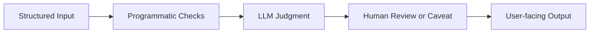

# MVP Lab

Purpose: build quick demo websites for non-AI-agent users, using content feedback
as the input signal.

Every demo runs as a structured workflow under the agentic harness in
[docs/AGENTIC_HARNESS.md](../docs/AGENTIC_HARNESS.md). The mvp-demo workflow in
[docs/WORKFLOW_PATTERNS.md](../docs/WORKFLOW_PATTERNS.md), the
mvp-discovery-pack in [docs/CONTEXT_STRATEGY.md](../docs/CONTEXT_STRATEGY.md),
and gates MVP1/MVP2 in [docs/HUMAN_GATES.md](../docs/HUMAN_GATES.md) all apply.

## Design Principle: Demos Are Structured Workflows

A demo is not an "AI agent doing magic." It is a small, predictable pipeline:



Each demo must explicitly define each box before any code is written:

- Input: what fields the user provides, with validation rules.
- Programmatic checks: what the demo verifies before calling any model (units,
  ranges, ticker validity, missing fields).
- LLM judgment: what only the LLM can do (synthesis, classification, drafting).
- Human review or caveat: what the demo refuses to do alone, what disclaimers
  are shown, and where the user is redirected if a request crosses a risk line.
- Output: a single, time-boxed result the user can read or act on in under 5
  minutes.

If any of those four boxes is unclear, the demo is not ready to build. Run the
mvp-demo workflow until they are.

## MVP Principles

- Start with a repeated pain, not a cool agent idea.
- One user, one workflow, one result.
- No login unless needed.
- No brokerage credentials in early demos.
- Result should be useful in under 5 minutes.
- Use the demo as content: show the workflow and ask for feedback.
- Treat each demo as the agentic harness applied to one user task.

## Demo Workflow

1. Collect pain from comments, DMs, interviews, or personal workflow.
2. Write a one-page spec.
3. Build a clickable or working demo.
4. Publish a post showing before/after.
5. Capture feedback.
6. Decide improve, pivot, or archive.

## MVP Spec Template

```md
## MVP Spec

- Name:
- Target user:
- Pain:
- Current workaround:
- Promise:
- Input (with validation rules):
- Programmatic checks:
- LLM judgment role:
- Human review or caveat:
- Output:
- Time to value:
- Demo flow:
- Data sources:
- Trust/safety concerns:
- Risk level (low / medium / high):
- Required gates (MVP1, MVP2, IA1 if applicable):
- Success metric:
- Build scope:
- Non-goals:
- Kill criterion:
```

## First Demo Candidates

### Backtest Sanity Checker

Best for systematic trading learners. Strong trust-building content angle.

### Market Regime Explainer

Best for broad audience. Can turn weekly analysis into an interactive tool.

### AI Investing Prompt Coach

Best for non-agent users. Teaches how to ask better questions and verify answers.

### News to Scenario Analyzer

Best for timely content. Can convert market headlines into scenario posts.

### Portfolio Review Checklist

Best for practical user value. Avoid account integration at first; use manual input.

## Build Stack Defaults

Use the simplest stack that can ship:

- Static or Next.js app for demos.
- Simple form-based interaction.
- No database until feedback requires persistence.
- Email/waitlist capture only after value is clear.
- Logs or manual CSV for early feedback tracking.
- Programmatic checks live in plain code, not in prompts.
- LLM calls receive structured payloads only, never raw form text.
- Caveats and disclaimers are rendered by the app, not generated by the LLM.

## Kill Criteria

Archive or pivot if:

- People say it is interesting but do not use it.
- The output requires too much explanation.
- The demo is solving a builder problem, not a user problem.
- It requires sensitive data before trust exists.
- It cannot produce content or learning.
