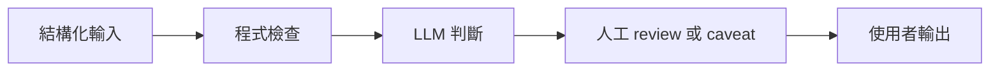

# MVP Lab（中文版）

> 中文鏡像 / 對照原文：[MVP_LAB.md](MVP_LAB.md)
> 英文是 LLM 主用版本；中文供人類 review 用。

目的：為非 AI agent 使用者快速做 demo 網站，把內容回饋當作輸入訊號。

每個 demo 都當成 agentic harness 下的 structured workflow 來跑，依
[docs/AGENTIC_HARNESS.zh.md](../docs/AGENTIC_HARNESS.zh.md) 操作。具體 workflow 在
[docs/WORKFLOW_PATTERNS.zh.md](../docs/WORKFLOW_PATTERNS.zh.md) 的 mvp-demo workflow，
context pack 在 [docs/CONTEXT_STRATEGY.zh.md](../docs/CONTEXT_STRATEGY.zh.md) 的
mvp-discovery-pack，gate 在 [docs/HUMAN_GATES.zh.md](../docs/HUMAN_GATES.zh.md) 的
MVP1 / MVP2。

## 設計原則：Demo 是 Structured Workflow

Demo 不是「AI agent 在變魔術」。它是一個小、可預期的 pipeline：



寫任何 code 前，每個 demo 都要明確定義這四個區塊：

- Input：使用者要填的欄位與 validation 規則。
- 程式檢查：呼叫任何模型前要驗的東西（單位、範圍、ticker 是否合法、缺漏欄位）。
- LLM 判斷：只有 LLM 做得好的事（synthesis、分類、起草）。
- 人工 review 或 caveat：demo 不會單獨做的事、會顯示什麼免責聲明、若使用者越線
  該被引導到哪裡。
- Output：使用者 5 分鐘內可以讀完或行動的單一結果。

如果上面任一塊不清楚，這個 demo 還不能開工。回去跑 mvp-demo workflow 直到清楚。

## MVP 原則

- 從重複出現的 pain 出發，不是從「酷的 agent 想法」出發。
- 一個使用者、一個 workflow、一個結果。
- 不需要登入就不要登入。
- 早期 demo 不要碰 brokerage 憑證。
- 結果必須在 5 分鐘內有用。
- 把 demo 當內容用：展示 workflow 並請使用者回饋。
- 把每個 demo 看成「agentic harness 套用到一個 user task」。

## Demo 工作流程

1. 從留言、DM、訪談、自己的 workflow 收集 pain。
2. 寫一頁 spec。
3. 做 clickable 或可運作的 demo。
4. 發一篇 before/after post。
5. 收 feedback。
6. 決定 improve、pivot、archive。

## MVP Spec 模板

```md
## MVP Spec

- Name:
- Target user:
- Pain:
- Current workaround:
- Promise:
- Input (with validation rules):
- Programmatic checks:
- LLM judgment role:
- Human review or caveat:
- Output:
- Time to value:
- Demo flow:
- Data sources:
- Trust/safety concerns:
- Risk level (low / medium / high):
- Required gates (MVP1, MVP2, IA1 if applicable):
- Success metric:
- Build scope:
- Non-goals:
- Kill criterion:
```

## 第一波 Demo 候選

### Backtest Sanity Checker

最適合系統交易學習者。內容上是建立信任的好題材。

### Market Regime Explainer

廣泛受眾。可以把每週分析變成可互動工具。

### AI Investing Prompt Coach

最適合非 agent 使用者。教他們怎麼問更好的問題、怎麼驗證答案。

### News to Scenario Analyzer

最適合即時內容。能把市場新聞轉成 scenario post。

### Portfolio Review Checklist

最有實用價值。先用手動輸入，先不要做帳戶整合。

## Build Stack 預設

用最簡單能上線的 stack：

- 靜態網站或 Next.js app。
- 簡單表單互動。
- 在回饋讓你必須做持久化前不要加資料庫。
- 在 demo 價值清楚之前不要加 email / waitlist 收集。
- 早期回饋追蹤用 log 或手動 CSV。
- 程式檢查寫在程式裡，不要塞在 prompt 裡。
- LLM 只收 structured payload，不要傳 raw 表單字串。
- Caveat 與 disclaimer 由 app 渲染，不由 LLM 生成。

## Kill Criteria

下列情況封存或 pivot：

- 大家說「有趣」但沒人用。
- 結果需要太多解釋。
- Demo 在解一個「builder 問題」，不是 user 問題。
- 在信任建立前就需要敏感資料。
- 沒辦法產出內容或學習。
